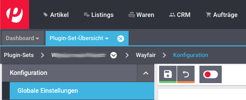
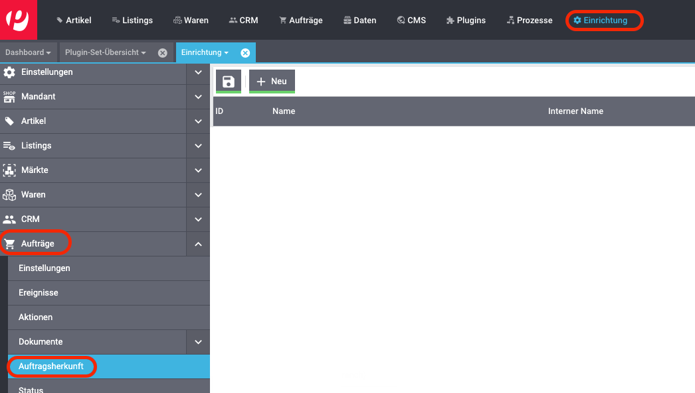
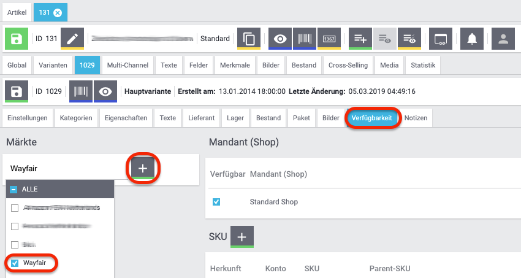
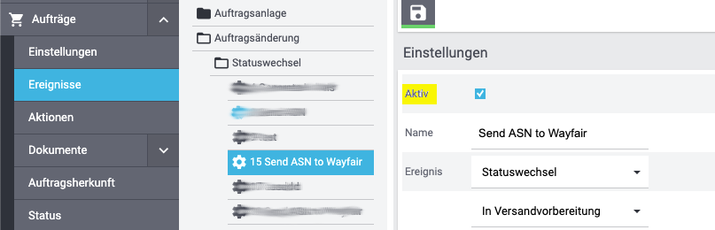

# Wayfair-Plugin: Ersteinrichtung

## Voraussetzungen

* [Ein Plentymarkets-System](https://www.plentymarkets.eu).

* Administratorrechte auf dem Plentymarkets-System, auf dem das Wayfair-Plugin verwendet wird
    - Die Einstellung `Zugang` des Plentymarkets-Benutzers muss `Admin` sein
    - Der Plentymarkets-Benutzer muss in der Lage sein, Plugin-Sets zu ändern

* Aktiver Wayfair-Lieferantenstatus
    * Eine Wayfair-Lieferanten-ID ist erforderlich
    * [Informationen für potenzielle Lieferanten](https://partners.wayfair.com/d/onboarding/sell-on-wayfair)

* [Wayfair API-Anmeldeinformationen](obtaining_credentials.md).

* [Installation des Wayfair-Plugins](plugin_installation.md).

## 1. Autorisierung des Wayfair-Plugins für den Zugriff auf Wayfair-Schnittstellen
Nachdem das Plugin in Ihrem Plentymarkets Plugin-Set installiert wurde, muss das Plugin so konfiguriert werden, dass beim Herstellen einer Verbindung zu den Wayfair-Schnittstellen die richtigen Anmeldeinformationen verwendet werden.

* **Das Autorisierungsverfahren muss für jedes Plugin-Set durchgeführt werden, welches das Wayfair-Plugin enthält.**
* Durch Kopieren eines Plugin-Sets werden die Autorisierungsinformationen in das neue Plugin-Set kopiert.
* Ein exportiertes oder importiertes Plugin-Set kann die Autorisierungsinformationen enthalten.

Die Schritte Autorisierung sind wie folgt:
1. Gehen Sie auf der Hauptseite von Plentymarkets zu `Plugins` >>` Plugin-Set-Übersicht`.

    

2. Suchen Sie das Plugin-Set, welches mit dem Client verknüpft ist, mit dem Wayfair verwendet wird.

    

3. Klicken Sie auf das gewünschte Plugin-Set.

4. Klicken Sie in der Wayfair-Zeile des Plugin-Sets auf die Schaltfläche `Einstellungen`. .

4. Gehen Sie im Menü auf der linken Seite zu `Konfiguration` >> `Globale Einstellungen`.

    

5. Geben Sie im Bereich `Lieferanteneinstellungen` die Werte `Client ID` und `Client Secret` ein, die Ihren Wayfair API-Anmeldeinformationen entsprechen.

6. Ändern Sie die Einstellung `Modus` in "Live" - ​​siehe [Informationen zum Modus `Test`](test_mode.md)

    

7. Klicken Sie in der Symbolleiste über den Einstellungen auf die Schaltfläche `Speichern`. 

## 2. Aktivieren der Auftragsherkunft
Die Auftragsherkunft in Plentymarkets identifiziert den Vertriebskanal, in dem ein Auftrag generiert wurde. Damit das Plentymarkets-System Aufträge ordnungsgemäß von der Wayfair-API importieren kann, muss die Wayfair-Auftragsherkunft aktiviert sein:

1. Gehen Sie auf der Hauptseite von Plentymarkets zu `Einrichtung` >>` Aufträge` >> `Auftragsherkunft`.

    

2. Setzen Sie ein Häkchen neben den Bestellempfänger `Wayfair`.

    

3. Klicken Sie auf `Speichern` .

## 3. Einrichten von Plentymarkets für den Versand über Wayfair
Befolgen Sie die [Anweisungen für den Versand über Wayfair](wayfair_shipping.md) beschriebenen Verfahren, um eine ordnungsgemäße Integration mit Wayfair für den Versand von Bestellartikeln sicherzustellen.

## 4. Verknüpfen Sie Wayfair-Bestellartikel mit Plentymarkets-Artikeln:
Um eingehende Bestellungen von Wayfair ordnungsgemäß verarbeiten zu können, muss das Wayfair-Plugin die Lieferanten-Teilenummern aus Wayfairs Systemen mit einem bestimmten Feld von Artikelvariationen in Plentymarkets abgleichen. Standardmäßig geht das Wayfair-Plugin davon aus, dass die `Variationsnummer` **(nicht die ID der Varianten)** der Varianten eines Artikels in Plentymarkets mit der Teilenummer des Wayfair-Lieferanten übereinstimmt.

Wenn die Lieferanten-Teilenummern für Ihre Organisation in einem alternativen Feld in Ihren Plentymarkets-ArtikelVarianten angezeigt werden, ändern Sie den Wert von [`Item Mapping Method`](settings_guide.md#item-mapping-method).

## 5. Artikel auf Wayfair zum Verkauf anbieten
Artikel, die Sie auf Wayfair verkaufen möchten, müssen in Plentymarkets als aktiv markiert werden. Der Benutzer von Plentymarkets kann auch festlegen, welche Artikel auf Wayfair zum Verkauf stehen. **Beachten Sie, dass der Lagerbestand und die bestellten Artikel auf der Ebene "Varianten" gesteuert werden.**

Dieses Verfahren ist nur erforderlich, wenn [die Einstellung `Vollständigen Bestand an Wayfair senden?`](settings_guide.md#vollständigen-bestand-an-wayfair-senden) **deaktiviert** ist:

1. Gehen Sie auf der Hauptseite von Plentymarkets zu `Artikel` >> `Artikel bearbeiten`.

2.  Suchen Sie nach Artikeln und öffnen Sie sie **`Stellen Sie sicher, dass auf dem Artikel die **`Hauptvariante`** steht`** siehe Bild unten

    

3. Stellen Sie auf der Registerkarte `Einstellungen` sicher, dass das Kontrollkästchen `Aktiv` im Abschnitt `Verfügbarkeit` aktiviert ist.

        

4. Wenn [die Einstellung `Vollständigen Bestand an Wayfair senden?`](settings_guide.md#vollständigen-bestand-an-wayfair-senden) **deaktiviert** ist, wechseln Sie zur Registerkarte `Verfügbarkeit` des Artikels und fügen Sie `Wayfair` zur Liste im Bereich `Märkte` hinzu.
    1. Klicken Sie in den Bereich `Klicken, um Märkte auszuwählen`.

    2. Scrollen Sie nach unten zum Eintrag `Wayfair`

    3. Setzen Sie ein Häkchen neben `Wayfair`

    4. Klicken Sie auf die Schaltfläche `+`  im Bereich `Märkte`.

        

    5. Beachten Sie, dass in `Märkte` jetzt eine `Wayfair` -Reihe vorhanden ist

        

5. Klicken Sie auf die Schaltfläche `Speichern` neben der Artikel-ID (nicht auf die obere Schaltfläche für den Artikel).

        

## 6. Konfigurieren der Lagerzuordnungen so, dass sie mit den Wayfair-Lieferanten-IDs übereinstimmen.

Um die Inventardaten im Wayfair-System zu aktualisieren, müssen Sie die Lager in Ihrem Plentymarkets-System den Lieferanten-IDs auf der Seite [Lager](settings_guide.md#die-seite-lager) der [Einstellungen des Plugins zuordnen](settings_guide.md).

## 7. Konfigurieren von Plentymarkets zum Senden von Versandsbestätigungen (ASN) an Wayfair

### 7.1 Einstellen des Wayfair-Plugins, um die richtigen Versandinformationen an Wayfair zu senden
Lieferanten, die Bestellungen über ihre eigenen Konten versenden möchten (statt die Versanddienste von Wayfair zu nutzen), müssen die Konfigurationseinstellungen für [Versandbestätigung (ASN)](settings_guide.md#die-seite-versandsbestätigung-asn) entsprechend einstellen.

Wenn die Versanddienste von Wayfair verwendet werden sollen, sollten die ASN-Einstellungen des Wayfair-Plugins in ihren Standardeinstellungen (`Wayfair-Versand`) belassen werden.

### 7.2 Erstellen eines Ereignisses für Plentymarkets-Bestellungen, das Versandinformationen an Wayfair sendet

1. Gehen Sie auf der Hauptseite von Plentymarkets zu `Einrichtung` >>` Aufträge` >> `Ereignisse`.

    

2. Klicken Sie auf `Ereignisaktion hinzufügen` (die Schaltfläche `+` links am Seitenende).

    

3. Geben Sie einen beliebigen `Name` ein

4. Wählen Sie im Feld `Ereignis` die Option `Statuswechsel` (in der Kategorie `Auftragsänderung`).

     

5. Wählen Sie im Feld unter `Ereignis` die Statusänderung aus, die das Senden einer ASN an Wayfair auslösen soll, Z.b. `In Versandvorbereitung`.

    

6. Klicken Sie auf die Schaltfläche `Speichern` .

7. Sie sollten automatisch zur neu erstellten Ereignisaktion umgeleitet werden. Setzen Sie im Abschnitt `Einstellungen` der Ereignisprozedur ein Häkchen neben `Aktiv`.

    

8. Klicken Sie auf `Filter hinzufügen` und gehen Sie zu `Auftrag` >> `Herkunft`, um die Herkunft als Filter hinzuzufügen:

    

    

9. Klicken Sie auf `+ Hinzufügen`.

    

10. Im Abschnitt `Filter` sollte ein Feld mit einer Liste aller verfügbaren Auftragsverweise angezeigt werden. Setzen Sie ein Häkchen neben alle **"Wayfair"** -Auftragsempfänger:

    

11. Klicken Sie auf das `+` neben `Aktionen`:

    

12. Wählen Sie `Versandbestätigungen (ASN) an Wayfair senden` in der Kategorie `Plugins`:

    

13. Klicken Sie auf die Schaltfläche `Hinzufügen` .

14. Stellen Sie sicher, dass die Einstellungen des Ereignisses ungefähr so ​​aussehen:

    

16. Klicken Sie auf die Schaltfläche `Speichern` .

## 8. Ersten Inventar Synchronisation
Sobald alles eingerichtet ist, ist es Zeit für das Wayfair Plugin, Artikel zum Verkauf auf Wayfair aufzulisten.

### Version 1.1.4 und höher

Ab Version 1.1.4, ist der Inventarsynchronisierungsprozess des Wayfair-Plugins vollständig automatisiert und kann vom Plentymarkets-Benutzer nicht gestartet werden. Nachdem Sie alle früheren Schritte in diesem Handbuch ausgeführt haben, müssen Sie sicherstellen, dass das Wayfair-Plugin aktiv Inventarsynchronisierungen durchführt:

1. Suchen Sie [die Seite `Inventar`](settings_guide.md#die-seite-inventar) in den [Einstellungen für Wayfair Markt](settings_guide.md) **- Wenn die Seite `Vollständiges Inventar` nicht vorhanden ist, fahren Sie nicht fort - Sie müssen [die beschriebenen Schritte für frühere Versionen des Plugins](#version-1.1.3-und-niedriger)**.

2. Wenn die Inventar Synchronisierung noch nicht initialisiert wurde oder als problematisch gemeldet wird, warten Sie bitte 30 Minuten und überprüfen Sie die Seite erneut.

3. Wenn die Seite 30 Minuten nach dem Einrichten des Plugins Probleme mit der Inventarsynchronisierung meldet, versuchen Sie, diese zu beheben, indem Sie[die Anweisungen für die Seite `Inventar`](settings_guide.md#die-seite-inventar) überprüfen und [die Plentymarkets Logs](troubleshooting.md#plentymarkets-logs) anzeigen und mithilfe von [der Anleitung zur Fehlerbehebung](troubleshooting.md).

### Version 1.1.3 und niedriger

Frühere Versionen **(vor 1.1.4)** des Wayfair Plugin können die erste Inventarsynchronisierung nicht automatisch durchführen und erfordern manuelle Eingriffe:

1. Suchen Sie die Seite `Voll Inventar` in den [Einstellungen für Wayfair Markt](settings_guide.md). **- Wenn die Seite `Vollständiges Inventar` nicht vorhanden ist, fahren Sie nicht fort - zeigen Sie [die Informationen für moderne Versionen des Plugins](#version-1.1.4-und-höher) an.**

2. Klicken Sie auf die Schaltfläche `Jetzt synchronisieren`.

3. Warten Sie auf die Ergebnisse.

4. Wenn die Ergebnisse auf Probleme hinweisen, [die Plentymarkets Logs](troubleshooting.md#plentymarkets-logs) anzeigen und mithilfe von [der Anleitung zur Fehlerbehebung](troubleshooting.md).

### Nachfolgende Synchronisierungen

**Nach der ersten Inventarsynchronisierung sendet das Wayfair-Plugin regelmäßig Inventaraktualisierungen ohne manuelle Aktivierung an Wayfair.**
