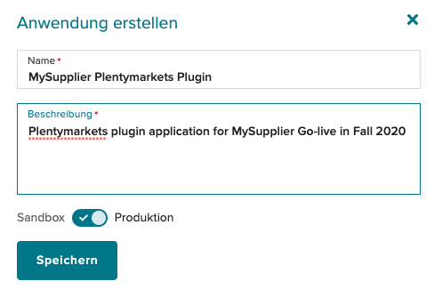
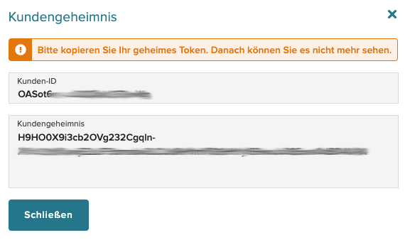

# Wayfair-Plugin: API-Anmeldeinformationen abrufen

Damit das Wayfair-Plugin eine Verbindung zu Wayfair-Systemen herstellen kann, müssen Sie Ihre eindeutigen API-Anmeldeinformationen angeben.

Gehen Sie folgendermaßen vor, um die API-Anmeldeinformationen für Ihre Organisation zu erhalten:

## 1. Senden Sie eine E-Mail an Wayfair

Bitte senden Sie eine E-Mail an Ihren Wayfair-Account Manager und kopieren Sie (CC) ERPSupport@wayfair.com, um Unterstützung anzufordern:

- Betreff: Zugriff auf das Plentymarkets-Plugin / (Name Ihres Unternehmens) (Wayfair-Lieferanten-ID)
- Inhalt:
    - Ihre Kontaktinformationen
    - kurze Beschreibung, wie Sie das Plentymarkets-Plugin verwenden möchten
    - Datum, an dem Sie bereit sind das Wayfair Plentymarkets Plugin zu verwenden

Sie erhalten umgehend eine Antwort mit folgenden Angaben:
- Bestätigung Ihres eingerichteten API-Zugriffs.
- Lieferanten-ID(s) für Ihre Lager.

## 2. Anmeldeinformationen für die Anwendung generieren

1. Gehen Sie zu https://partners.wayfair.com/developer/applications

2. Geben Sie Ihre Wayfair Partner Home-Anmeldeinformationen ein. Sie sollten zur Seite "Anwendungsverwaltung" für Wayfair weitergeleitet werden.

3. Klicken Sie auf der Seite "Anwendungsverwaltung" unten auf die Schaltfläche "+ Neue Anwendung". 

4. Geben Sie auf dem Formular "Neue Bewerbung" die Details der neuen Bewerbung an:
    * `Name`: Eine nützliche Kennung wie "[Name des Lieferanten] Plentymarkets Plugin".
    * `Description`: so etwas wie "Plentymarkets Plugin-Anwendung für [Name des Lieferanten] Go-Live im Herbst 2020".

5. Verwenden Sie den Schieberegler am unteren Rand des Dialogfelds, um ihn auf "Produktion" zu setzen, sofern Wayfair nichts anderes anordnet.

6. Klicken Sie im Dialogfeld auf "Speichern", um die Anmeldeinformationen der Anwendung anzuzeigen - `Kunden-ID` und `Kundengeheimnis`.

    

7. Kopieren Sie die `Kunden-ID` und das `Kundengeheimnis`
    

    * **Das `Kundengeheimnis` kann nach diesem Zeitpunkt nicht mehr abgerufen werden und es muss ein neues generiert werden, wenn das Original verloren geht.**

    * Diese Anmeldeinformationen werden für [die Autorisierung des Wayfair-Plugins](initial_setup.md#1-Autorisierung-des-Wayfair--Plugins-für-den-Zugriff-auf-Wayfair--Schnittstellen) für die Verwendung der Wayfair-Systeme verwendet.

8. Schließen Sie das Dialogfeld mit den Anmeldeinformationen, um die Informationen zu schützen.

9. Überprüfen Sie die [zusätzlichen Informationen zu Anmeldeinformationen](tips_and_tricks.md#Schutz-Ihrer-Anmeldeinformationen).
