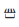
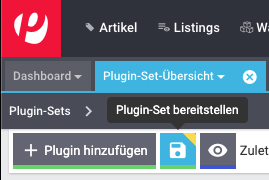
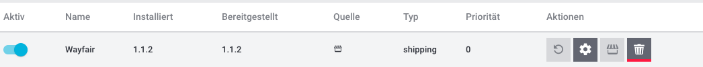

# Wayfair Plugin: Installationsanleitung
Das Wayfair-Plugin ist **kostenlos** auf dem offiziellen plentyMarketplace von Plentymarkets erhältlich. Dieses Dokument behandelt die Schritte, die erforderlich sind, um das Plugin für die Verwendung in einem Plentymarkets-System verfügbar zu machen.

## 1. Das Wayfair-Plugin in Plentymarkets verfügbar machen
Plentymarkets-Systeme werden standardmäßig nicht mit dem Wayfair-Plugin geliefert.
Befolgen Sie diese Schritte, um es zur Verwendung verfügbar zu machen:

1. Melden Sie sich beim Plentymarkets-System an.

2. Gehen Sie auf der Hauptseite von Plentymarkets zu `Plugins` >>` plentyMarketplace`. Die Anmeldeinformationen des Eigentümers des Plentymarkets-Systems werden verwendet, um auf die Website "plentyMarketplace" zuzugreifen:

    

3. Klicken Sie auf die Suchschaltfläche in der oberen rechten Ecke der Seite.

4. Geben Sie "Wayfair" in das Feld ein und drücken Sie die Eingabetaste.

5. Wenn auf der oberen Seite ein Banner `Sie haben dieses Plugin gekauft` und / oder ein Banner `Bereits gekauft` auf der Seite angezeigt wird, fahren Sie mit den Anweisungen unter [Installieren des Plugins in einem Plugin-Set](#2-installieren-des-wayfair-plugins-in-einem-plugin-set) fort.

6. Klicken Sie auf die Schaltfläche `Zur Kasse`.

7. Füllen Sie alle Felder des Kaufformulars aus.

8. Akzeptieren Sie die Allgemeinen Geschäftsbedingungen.

9. Klicken Sie auf `Jetzt kaufen` und warten Sie auf die Bestätigung. Das Plugin wird in Kürze im System verfügbar sein.

## 2. Installieren des Wayfair-Plugins in einem Plugin-Set
Um die Funktionen des Wayfair-Plugins nutzen zu können, muss es in den aktiven Plugin-Sets des Plentymarkets-Systems installiert sein. Befolgen Sie diese Anweisungen, um die Installation abzuschließen:

1. Gehen Sie auf der Hauptseite von Plentymarkets zu `Plugins` >>`Plugin-Set-Übersicht`.

    

    * **Wählen Sie nicht die veraltete Option `Plugin-Übersicht` aus**.
    * Auf dem Bildschirm sollte eine Liste der Plugin-Sets mit jeweils einer Reihe von Schaltflächen angezeigt werden.

2. Erstellen Sie das Plugin-Set, in dem das Plugin installiert werden soll, falls das gewünschte Plugin-Set noch nicht vorhanden ist.

    * Wenn Sie bereits andere Plugins installiert haben, möchten Sie möglicherweise eine Kopie eines vorhandenen Plugin-Sets über die entsprechende `Plugin-Set kopieren`-Schaltflächen verwenden. 

    * Ihre Plentymarkets-Lizenz kann unter Umständen die Anzahl der Plugin-Sets begrenzen, die gleichzeitig existieren können.

3. Konfigurieren Sie die Plugin-Sets, die von Plentymarkets verwendet werden sollen
    * Das Feld `Verknüpfte Mandanten` für das Plugin-Set sollte die Namen aller Plentymarkets Mandanten enthalten, für die die Wayfair-Plugin-Funktionalität gewünscht wird.

        

    * Verwenden Sie optional die Schaltflächen `Mandanten und Plugin-Sets verknüpfen`, um die Verknüpfungen zwischen Mandanten und Plugin-Sets zu ändern.
        

4. Klicken Sie auf das Plugin-Set, an in es für das Wayfair-Plugin installiert werden.

5. Klicken Sie auf die Schaltfläche `+ Plugin hinzufügen`
    

6. `Wayfair` sollte in der Liste der Plugins erscheinen. Wenn es viele Plugins gibt, geben Sie "Wayfair" in das Feld `Suchen` ein
    

7. Klicken Sie in der Liste auf den Eintrag `Wayfair`. Das Wayfair-Logo sollte mit einer Schaltfläche `Installieren` angezeigt werden. ()

    * Wenn Sie das Wayfair-Plugin zuvor über den Kanal `git` installiert haben, gibt es möglicherweise mehrere Einträge für `Wayfair`. Bitte wählen Sie den Eintrag mit der Quelle `Marktplatz`.

8. Überprüfen Sie die Informationen auf der Seite.

    

9. Wählen Sie im Dropdown-Menü "Version auswählen" die Option [die neueste Plugin-Version](https://github.com/wayfair-contribs/plentymarkets-plugin/releases), falls diese noch nicht ausgewählt ist.

10. Klicken Sie oben auf der Seite auf die Schaltfläche `Installieren` . Sie werden zu den Details des Plugin-Sets weitergeleitet.

11. Stellen Sie sicher, dass auf der Seite eine Zeile mit dem Namen `Wayfair` und der installierten Version als gewünschte Version vorhanden ist.

12. Klicken Sie in der Spalte `Aktiv` für die Zeile `Wayfair` auf den Schalter, damit er sich in die aktivierte Position auf der rechten Seite bewegt. **Wenn das Wayfair-Plugin nicht aktiviert wird, sind seine Funktionen nicht verfügbar**.

13. Klicken Sie oben auf der Seite auf die Schaltfläche `Plugin-Set bereitstellen` (wird als Schaltfläche "Speichern" angezeigt). Während der Installation des Plugins wird ein Fortschrittsbalken angezeigt.

    

14. Vergewissern Sie sich, dass die Spalte `Bereitgestellt` für die Zeile `Wayfair` jetzt ausgefüllt ist und den Wert in der Spalte `Installiert` widerspiegelt.

    

15. Stellen Sie sicher, dass die Spalte `Bereitgestellt` für die Zeile `Wayfair` jetzt ausgefüllt ist und den Wert in der Spalte `Installiert` wiedergibt (Ihre Version `Installiert` oder `Bereitgestellt` kann unterschiedlich sein).

    

16. Melden Sie sich vom Plentymarkets System ab und dann wieder an, um sicherzustellen, dass die Änderungen wirksam werden.
