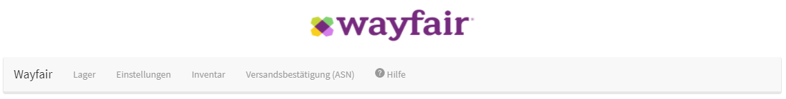
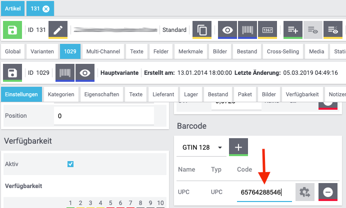
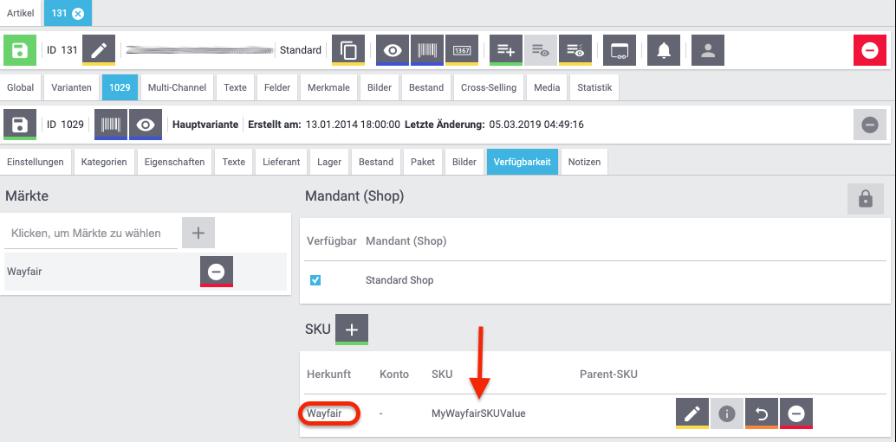
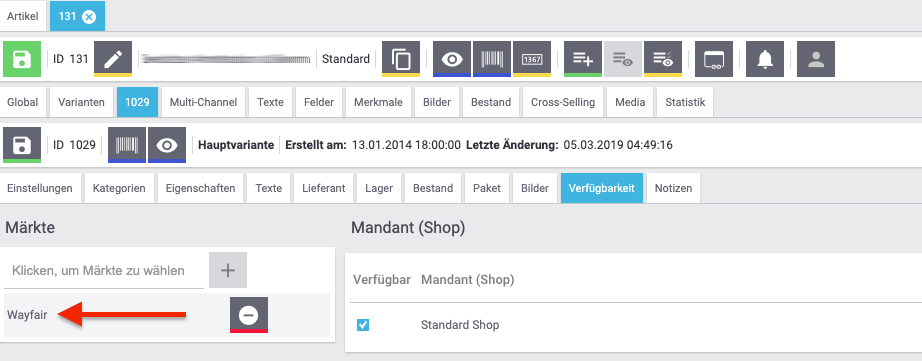

# Wayfair Plugin: Einstellungen für Wayfair Markt

Das Wayfair-Plugin enthält eine Sammlung von Einstellungen zur Steuerung des Plugin-Verhaltens.
Diese Einstellungen sollten erst konfiguriert werden, nachdem die [Autorisierungseinstellungen für das Plugin](initial_setup.md#1-autorisieren-des-wayfair-plugins-für-den-zugriff-auf-wayfair-schnittstellen) für das aktive Plugin-Set konfiguriert wurden.

## Öffnen der Einstellungsseite

So suchen Sie die Einstellungen:

1. Melden Sie sich bei Plentymarkets als Benutzer mit Administratorrechten an

2. Klicken Sie in der oberen Navigationsleiste von Plentymarkets auf `Einrichtung`

    

3. Klicken Sie in der linken Navigationsleiste der Benutzeroberfläche auf `Märkte`

    

4. Klicken Sie in der Liste der Märkte auf `Wayfair`. Es wird möglicherweise unten angezeigt, anstatt alphabetisch geordnet zu sein.

5. Klicken Sie unter `Wayfair` auf `Startseite`

    

6. Sie können jetzt die Wayfair-Navigationsleiste verwenden, um eine Einstellungsseite wie [`Lager`](#die-lager-seite) auszuwählen.

    

## Die Home Seite

Die Home Seite wird durch Klicken auf `Startseite` im Menü auf der linken Seite oder durch Klicken auf `Wayfair` in der Wayfair-Navigationsleiste aktiviert. Derzeit werden keine Informationen bereitgestellt.

## Die Lager Seite

Die Lager Seite wird verwendet, um die Lager, die der Lieferant in Plentymarkets verwendet, mit den Wayfair Lieferanten IDs zu verknüpfen, die dem Lieferanten ausgestellt wurden. Die Zuordnungen werden vom Wayfair-Plugin verwendet, wenn es Inventar an Wayfair meldet und Wayfair-Bestellungen verarbeitet, die bei Plentymarkets eingehen.

### Hinweise zu mehreren Lagern pro Wayfair-Lieferanten-ID

Die Topographie des Plentymarkets-Systems stimmt möglicherweise nicht mit der Anzahl der Wayfair Lieferanten-IDs überein. Es ist akzeptabel, eine Wayfair-Lieferanten-ID für mehr als eines der Plentymarkets-Lagerhäuser zu verwenden. **Dies kann jedoch zu unerwartetem Verhalten führen. Beispielsweise kann das Wayfair plugin möglicherweise nicht das richtige Lager für eingehende Bestellungen ermitteln.** -Weitere Informationen finden Sie unter https://github.com/wayfair-contribs/plentymarkets-plugin/issues/92.

Überprüfen Sie bei der Auswahl einer Beziehung zwischen Lagern und Lieferanten ID, die nicht eins zu eins übereinstimmt, das Verhalten der Einstellung [Lagerpuffer](#Lagerpuffer).

### Hinzufügen einer Lager-Zuordnung

1. Klicken Sie auf die Schaltfläche `Zuordnung hinzufügen` .

2. Verwenden Sie die linke Spalte, um ein Plentymarkets-Lager nach Namen auszuwählen.

3. Geben Sie in der rechten Spalte eine numerische Lieferanten-ID ein.

4. Klicken Sie auf die Schaltfläche `Speichern` , sobald die neuen Zeilen abgeschlossen sind.

### Entfernen einer Lager-Zuordnung
1. Suchen Sie die zu entfernende Zeile
2. Klicken Sie in der Zeile auf die Schaltfläche `Löschen` 
3. Klicken Sie auf die Schaltfläche `Speichern` , sobald die gewünschten Zeilen entfernt wurden

## Die Einstellungen-Seite
Diese Seite enthält allgemeine Einstellungen für den Betrieb des Wayfair-Plugins.
Einstellungen werden bei Änderungen nicht automatisch gespeichert. Verwenden Sie die Schaltfläche `Speichern`  unten auf der Seite.

### Lagerpuffer
Die Einstellung `Lagerpuffer` ist eine nicht negative Ganzzahl, die für jede Artikelvariante für jede Wayfair Lieferanten ID eine reservierte Lagermenge festlegt. Der Pufferbetrag wird abgezogen, nachdem alle anderen Bestandsberechnungen durchgeführt wurden, einschließlich der Aggregation der Bestände für mehrere Plentymarkets Lager, denen dieselbe Wayfair Lieferanten ID zugewiesen wurde.

Um den `Lagerpuffer` zu deaktivieren, lassen Sie diese Einstellung leer oder setzen Sie sie auf `0`.

### Standard-Bestellstatus
Die Einstellung `Standard-Bestellstatus` bestimmt, in welchem ​​Status sich eine neue Plentymarkets-Bestellung nach der Erstellung durch das Wayfair-Plugin befinden soll.

**Hinweis:** Die Auftragserstellung gilt nicht als Änderung des Auftragsstatus. Wenn Sie den Standardbestellstatus auf einen höheren als die Statuswerte für konfigurierten Plentymarkets-Ereignisse setzen, können einige Ereignisse fehlschlagen.

### Standardversandanbieter **(nicht genutzt)**
Die Einstellung `Standardversandanbieter` ist eine Legacy-Einstellung, die das Verhalten des Plugins nicht mehr beeinflusst.
**Wenn diese Einstellung in Ihrem System angezeigt wird, empfiehlt Wayfair dringend, dass Sie Ihr Plugin auf eine neuere Version aktualisieren.**

<<<<<<< HEAD
### Artikel Zuordnungsmethode
Die Einstellung `Artikel Zuordnungsmethode` bestimmt das Verhalten beim Abgleichen der Artikelvariationen von Plentymarkets mit den Wayfair-Produkten. Es wird verwendet, wenn die Bestandslisten an Wayfair gesendet werden und um die angeforderten Produkte in einer Wayfair-Bestellung auszuwählen. Der Benutzer von Plentymarkets sollte diese Einstellung so konfigurieren, dass sie der Art und Weise entspricht, in der die Elementvariationen ausgefüllt werden.
=======
### Methode zur Artikelzuweisung
Die Einstellung `Methode zur Artikelzuweisung` bestimmt das Verhalten beim Abgleichen der Artikelvariationen von Plentymarkets mit den Wayfair-Produkten. Es wird verwendet, wenn die Bestandslisten an Wayfair gesendet werden und um die angeforderten Produkte in einer Wayfair-Bestellung auszuwählen. Der Benutzer von Plentymarkets sollte diese Einstellung so konfigurieren, dass sie der Art und Weise entspricht, in der die Elementvariationen ausgefüllt werden.
>>>>>>> origin/main

### Verwenden der Variationsnummer als Elementzuordnungsfeld
Standardmäßig wird das Feld `Variationsnummer` für die Zuordnung der Artikel von Wayfair-Bestellungen zu Artikelvariationen von Plentymarkets verwendet.

Die anderen Optionen sind `EAN` (Barcode) und `SKU`.

#### Verwenden von EAN (Barcode) als Elementzuordnungsmethode
Wenn die `Methode zur Artikelzuweisung` auf `EAN` eingestellt ist, sollte jede Artikelvariation in Plentymarkets so eingerichtet werden, dass sie einen Barcode enthält, der die Wayfair-Lieferanten-Teilenummer widerspiegelt, die Wayfair in eingehenden Bestelldaten sendet:

1. Gehen Sie auf der Hauptseite von Plentymarkets zu `Artikel` >>` Artikel bearbeiten`

2. Suchen Sie nach Artikeln, die auf Wayfair verkauft werden sollen

3. **Klicken Sie für jeden Artikel** auf den Artikel in den Suchergebnissen und dann auf `Varianten`

4. **Für jede der Varianten**:
    1. Klicken Sie auf die Registerkarte `Einstellungen`

    2. Wählen Sie im Abschnitt `Barcode` einen Barcode-Typ aus,

    3. Klicken Sie auf die Schaltfläche `Hinzufügen` 
    und geben Sie den Barcode-Wert in das Feld `1`Code` ein. Der Barcode sollte mit der Wayfair-Lieferanten-Teilenummer übereinstimmen.

    4. Klicken Sie auf der Variantenstufe auf die Schaltfläche `Speichern`  (nicht zu verwechseln mit der Schaltfläche `Speichern` für den Artikel, einige Zeilen darüber).

#### Verwenden der SKU als Elementzuordnungsmethode
Wenn die "Artikelzuordnungsmethode" auf "SKU" eingestellt ist, sollte jede Artikelvariation in Plentymarkets so eingerichtet werden, dass sie eine Wayfair-spezifische SKU enthält, die die Wayfair-Lieferanten-Teilenummer widerspiegelt, die Wayfair in eingehenden Bestelldaten sendet:

1. Gehen Sie auf der Hauptseite von Plentymarkets zu `Artikel` >>` Artikel bearbeiten`

2. Suchen Sie nach Artikeln, die auf Wayfair verkauft werden sollen

3.  **Klicken Sie für jeden Artikel** auf den Artikel in den Suchergebnissen und dann auf `Varianten`

4. **Für jede der Varianten**:
    1. Klicken Sie auf die Registerkarte `Verfügbarkeit`
    2. Klicken Sie im Abschnitt `SKU` auf die Schaltfläche `Hinzufügen` 
    3. Wählen Sie im Popup-Fenster `Wayfair` für `Herkunft`, geben Sie die Wayfair-Lieferanten-Teilenummer in das Feld `SKU` ein und klicken Sie auf `Hinzufügen`
    4. Klicken Sie auf "Hinzufügen" 
    5. Klicken Sie auf der Variantenebene auf die Schaltfläche `Speichern`  (nicht zu verwechseln mit der Schaltfläche `Speichern` für den Artikel, einige Zeilen darüber).

### Aufträge importieren ab
Die optionale Einstellung `Aufträge importieren ab` bestimmt ein Datum, ab dem neue Wayfair-Bestellungen als für den Import in das Plentymarkets-System berechtigt gelten. Diese Einstellung kann die Leistung verbessern, indem verhindert wird, dass das Wayfair-Plugin Bestellungen anfordert, die vor dem angegebenen Datum erstellt wurden. Es kann auch verwendet werden, um zu verhindern, dass das Plentymarkets-System Bestellungen vor einem gewünschten "Go-Live-Datum" annimmt.

### Vollständigen Bestand an Wayfair senden?
Die optionale Einstellung `Vollständigen Bestand an Wayfair senden?` legt fest, ob Plentymarkets-Artikelvariationen ausdrücklich als für den Verkauf auf Wayfair geeignet deklariert werden müssen oder nicht.
Wenn `Vollständigen Bestand an Wayfair senden?` Deaktiviert ist, muss `Wayfair` in der Liste `Märkte` der Artikelvariationen enthalten sein, die auf Wayfair verkauft werden sollen, wie in diesem Beispiel dargestellt:

Durch Aktivieren von `Vollständigen Bestand an Wayfair senden?` Kann Wayfair alle Artikel auflisten, von denen festgestellt wird, dass sie derzeit auf Lager sind, einschließlich der Artikelvariationen, für die "Wayfair" **nicht** in der "Märkte" -Liste enthalten ist.

## Die Seite Inventar
**(Seit Version 1.1.4)**

Die Seite `Inventar` enthält keine zu konfigurierenden Einstellungen.
Sie wird verwendet, um den Status der Synchronisierung des Plentymarkets-Inventars mit Wayfair zu überprüfen
Die Daten auf der Seite werden im Laufe der Zeit automatisch aktualisiert, wie durch den Zeitstempel am unteren Ende der Seite dargestellt.

## Hauptstatusanzeige

Oben auf der Seite "Inventar" werden immer ein Symbol und eine Meldung angezeigt, um den allgemeinen Zustand des Inventarsynchronisierungsprozesses zu beschreiben.

* Ein Kalendersymbol  wird angezeigt, wenn das Wayfair-Plugin noch keine Inventarsynchronisierung versucht hat.

    * Dies geschieht direkt nach der Installation des Plugins.
    * Dies kann passieren, wenn das Plugin kürzlich aktualisiert wurde.
    * Die Seite ändert sich innerhalb von 15 bis 30 Minuten, sobald das Synchronisationssystem initialisiert wird.

* Ein Symbol mit einem Häkchen  wird angezeigt, wenn das Wayfair Plugin das Inventar regelmäßig synchronisiert, ohne dass Probleme festgestellt werden.

* Ein Symbol mit einer durchgestrichenen Wolke  wird angezeigt, wenn das Wayfair-Plugin Unregelmäßigkeiten bei der Inventarsynchronisierung feststellt.

    * Fehler werden erwartet, wenn das Wayfair-Plugin kürzlich installiert wurde und [der Ersteinrichtung](initial_setup.md) noch nicht abgeschlossen wurde. Beenden Sie die Einrichtung des Plugins, bevor Sie die Seite `Inventar` erneut verwenden.
    * Details werden möglicherweise weiter unten auf der Seite angezeigt, um zu erklären, was falsch ist.
    * Zeigen Sie [die Plentymarkets Logs](troubleshooting.md#plentymarkets-logs) an, um Fehlerdetails zu erhalten.
    * Im [Handbuch zur Fehlerbehebung](troubleshooting.md) des Wayfair-Plugins  finden Sie Ideen zur Lösung von Problemen bei der Inventarsynchronisierung.

### Details zur Inventarsynchronisierung

Wenn dies möglich ist, enthält die Seite "Inventar" Details zur Unterstützung des Hauptstatus, der oben auf der Seite angezeigt wird.

* Ein Kalendersymbol  zeigt an, dass eine Information noch nicht verfügbar ist.

* Ein Symbol mit einem Häkchen  zeigt ein positives Ereignis an.

* Ein Symbol mit einer durchgestrichenen Wolke  zeigt ein negatives Ereignis an.

* Ein Symbol mit einem Pfeil nach oben zu einer Wolke  zeigt an, dass ein Ereignis gerade stattfindet und wird beschrieben, sobald es abgeschlossen ist.

## Die Seite Voll Inventar
**(In 1.1.4 entfernt)**

Die Seite `Voll Inventar` wurde durch die Seite [`Inventar`](#die-seite-inventar) ersetzt. **Wenn Sie eine Version des Wayfair Plugin verwenden, die die Seite `Voll Inventar` enthält, empfiehlt Wayfair, das Plugin so bald wie möglich zu aktualisieren.**

Detaillierte Informationen zur Seite `Voll Inventar` finden Sie in [der Dokumentation zu Version 1.1.3](https://github.com/wayfair-contribs/plentymarkets-plugin/blob/release-1.1.3/meta/documents/user_guide/de/settings_guide.md#die-seite-voll-inventar).

## Die Seite Versandsbestätigung (ASN)
Die Seite `Versandsbestätigung (ASN)` wird zum Konfigurieren der Versandinteraktionen zwischen Plentymarkets, dem Wayfair Plugin und Wayfair verwendet.
Die hier bereitgestellten Informationen legen das Verhalten für den `Versandsbestätigung (ASN) an Wayfair senden`-Prozess für Bestellungen fest.

### Versandart
Das Optionsfeld oben auf der Seite enthält diese Optionen.
Wayfair gibt Lieferanten Anweisungen zur Auswahl des richtigen Werts.
* `Wayfair Versand`
    * Die Sendungen Ihrer Bestellungen werden von Wayfair arrangiert und von einem von Wayfair ausgewählten Spediteur versendet.
    * Das Plentymarkets-System muss Wayfair mitteilen, wann die Bestellung versandbereit ist.
    * Das Plentymarkets-System muss Tracking-Informationen von Wayfair in Ihre Plentymarkets-Bestellungen zurückerhalten.

* `Selbst Versende`
    * Sie versenden Ihre eigenen Bestellungen über Ihre eigenen Spediteure.
    * Das Plentymarkets-System muss Wayfair mitteilen, wenn Sie eine Bestellung versenden.
    * Das Plentymarkets-System muss Wayfair die Tracking-Informationen mitteilen (Spediteur und Tracking-Nummer).

### Zuordnung von Plentymarkets-Speditionen zu Wayfair-Speditionen
Wenn Sie die Option `Selbst Versende` auswählen, muss Wayfair die Versandinformationen von Plentymarkets in Daten übersetzen, die es versteht.
1. Suchen Sie die von Wayfair bereitgestellten Spediteurinformationen. Wenden Sie sich bei Bedarf an [ERPSupport@wayfair.com](mailto:ERPSupport@wayfair.com).
2. Geben Sie für jeden in der linken Spalte aufgeführten Plentymarkets `Versanddienstleister` den von Wayfair bereitgestellten "SCAC Code" in die rechte Spalte `Wayfair-Kennziffer des Versanddienstleisters` ein.
3. Klicken Sie unten auf der Seite auf `Speichern` 
