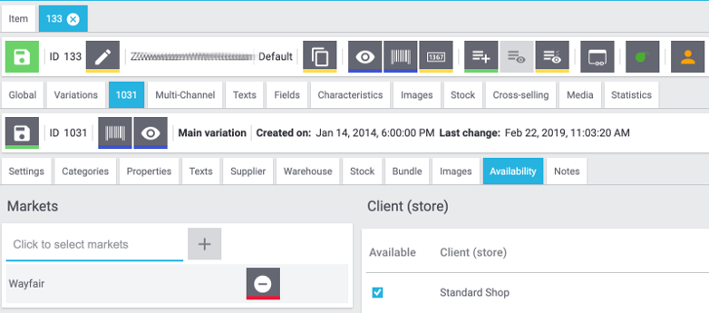

# Wayfair Plugin: Einstellungen für Wayfair Markt

Das Wayfair-Plugin enthält eine Sammlung von Einstellungen zur Steuerung des Plugin-Verhaltens.
Diese Einstellungen sollten erst konfiguriert werden, nachdem die [Autorisierungseinstellungen für das Plugin](initial_setup.md#1-autorisieren-des-wayfair-plugins-für-den-zugriff-auf-wayfair-schnittstellen) für das aktive Plugin-Set konfiguriert wurden.

## Öffnen der Einstellungsseite

So suchen Sie die Einstellungen:

1. Melden Sie sich bei Plentymarkets als Benutzer mit Administratorrechten an

2. Klicken Sie in der oberen Navigationsleiste von Plentymarkets auf `Einrichtung`

3. Klicken Sie in der linken Navigationsleiste der Benutzeroberfläche auf `Märkte`

4. Klicken Sie in der Liste der Märkte auf `Wayfair`. Es wird möglicherweise unten angezeigt, anstatt alphabetisch geordnet zu sein.

5. Klicken Sie unter `Wayfair` auf `Home`

6. Sie können jetzt die Wayfair-Navigationsleiste verwenden, um eine Einstellungsseite wie [`Lager`](#die-seite-lager) auszuwählen.

## Die Seite Home

Die Seite Home wird durch Klicken auf `Home` im Menü auf der linken Seite oder durch Klicken auf `Wayfair` in der Wayfair-Navigationsleiste aktiviert. Derzeit werden keine Informationen bereitgestellt.

## Die Seite Lager

Die Seite Lager wird verwendet, um die Lager, die der Lieferant in Plentymarkets verwendet, mit den Wayfair Lieferanten IDs zu verknüpfen, die dem Lieferanten ausgestellt wurden. Die Zuordnungen werden vom Wayfair-Plugin verwendet, wenn es Inventar an Wayfair meldet und Wayfair-Bestellungen verarbeitet, die bei Plentymarkets eingehen.

### Hinweise zu mehreren Lagern pro Wayfair-Lieferanten-ID

Die Topographie des Plentymarkets-Systems stimmt möglicherweise nicht mit der Anzahl der Wayfair Lieferanten-IDs überein. Es ist akzeptabel, eine Wayfair-Lieferanten-ID für mehr als eines der Plentymarkets-Lagerhäuser zu verwenden. **Dies kann jedoch zu unerwartetem Verhalten führen. Beispielsweise kann das Wayfair plugin möglicherweise nicht das richtige Lager für eingehende Waren ermitteln Bestellungen** -Weitere Informationen finden Sie unter https://github.com/wayfair-contribs/plentymarkets-plugin/issues/92.

Überprüfen Sie bei der Auswahl einer Beziehung zwischen Lagern und Lieferanten ID, die nicht eins zu eins ist, das Verhalten der Einstellung [Lagerpuffer] (#Lagerpuffer).

### Hinzufügen einer Warehouse-Zuordnung

1. Klicken Sie auf die Schaltfläche `Zuordnung hinzufügen`.

2. Verwenden Sie die linke Spalte, um ein Plentymarkets Warehouse nach Namen auszuwählen.

3. Geben Sie in der rechten Spalte eine numerische Lieferanten-ID ein.

4. Klicken Sie auf die Schaltfläche `Speichern`, sobald die neuen Zeilen abgeschlossen sind.

### Entfernen einer Warehouse-Zuordnung
1. Suchen Sie die zu entfernende Zeile
2. Klicken Sie in der Zeile auf die Schaltfläche `Löschen` 
3. Klicken Sie auf die Schaltfläche `Speichern`, sobald die gewünschten Zeilen entfernt wurden

## Die Site Einstellungen
Die Seite Einstellungen enthält allgemeine Einstellungen für den Betrieb des Wayfair-Plugins.
Einstellungen werden bei Änderungen nicht automatisch gespeichert. Verwenden Sie die Schaltfläche `Speichern` unten auf der Seite.

### Lagerpuffer
Die Einstellung `Lagerpuffer` ist eine nicht negative Ganzzahl, die für jede Artikelvariante für jede Wayfair Lieferanten ID eine reservierte Lagermenge festlegt. Der Pufferbetrag wird abgezogen, nachdem alle anderen Bestandsberechnungen durchgeführt wurden, einschließlich der Aggregation der Bestände für mehrere Plentymarkets Warehouses, denen dieselbe Wayfair Lieferanten ID zugewiesen wurde.

Um den `Lagerpuffer` zu deaktivieren, lassen Sie diese Einstellung leer oder setzen Sie sie auf `0`.

### Standard-Bestellstatus
Die Einstellung `Standard-Bestellstatus` bestimmt, in welchem ​​Status sich eine neue Plentymarkets-Bestellung nach der Erstellung durch das Wayfair-Plugin befinden soll.

**Hinweis:** Die Auftragserstellung gilt nicht als Änderung des Auftragsstatus. Wenn Sie den Standardbestellstatus auf einen höher als die Statuswerte für konfigurierten Plentymarkets-Ereignisse setzen, Einige Ereignisse können fehlschlagen.

### Standardversandanbieter **(nicht benutzt)**
Die Einstellung `Standardversandanbieter` ist eine Legacy-Einstellung, die das Verhalten des Plugins nicht mehr beeinflusst.
**Wenn diese Einstellung in Ihrem System angezeigt wird, empfiehlt Wayfair dringend, dass Sie Ihr Plugin auf eine neuere Version aktualisieren.**

### Item Mapping Method
Die Einstellung `Item Mapping Method` bestimmt das Verhalten beim Abgleichen der Artikelvariationen von Plentymarkets mit den Wayfair-Produkten. Es wird verwendet, wenn die Bestandslisten an Wayfair gesendet werden und um die angeforderten Produkte in einer Wayfair-Bestellung auszuwählen. Der Benutzer von Plentymarkets sollte diese Einstellung so konfigurieren, dass sie der Art und Weise entspricht, in der die Elementvariationen ausgefüllt werden.

Standardmäßig wird das Feld `Variationsnummer` zum Zuordnen der Artikel von Wayfair Orders zu Artikelvariationen von Plentymarkets verwendet.
Die anderen Optionen sind `EAN` (Barcode) und `SKU`.

#### Verwenden von EAN (Barcode) als Elementzuordnungsmethode
Wenn die `Item Mapping Method` auf `EAN` eingestellt ist, sollte jede Artikelvariation in Plentymarkets so eingerichtet werden, dass sie einen Barcode enthält, der die Wayfair-Lieferanten-Teilenummer widerspiegelt, die Wayfair in eingehenden Bestelldaten sendet:
1. Gehen Sie auf der Hauptseite von Plentymarkets zu `Artikel` >>` Artikel bearbeiten`

2. Suchen Sie nach Artikeln, die auf Wayfair verkauft werden sollen

3. **Klicken Sie für jedes Artikeln** auf das Artikeln in den Suchergebnissen und dann auf `Varianten`

4. **Für jede der Varianten**:
    1. Klicken Sie auf die Registerkarte `Einstellungen`
    2. Wählen Sie im Abschnitt "Barcode" einen Barcode-Typ aus, klicken Sie auf die Schaltfläche `Hinzufügen` und geben Sie den Barcode-Wert in das Feld `1`Code` ein. Der Barcode sollte mit der Wayfair-Lieferanten-Teilenummer übereinstimmen.
    3. Klicken Sie auf der Variantenstufe auf die Schaltfläche `Speichern` (nicht zu verwechseln mit der Schaltfläche `Speichern` für das Artikel, einige Zeilen oben).

#### Verwenden der SKU als Elementzuordnungsmethode
Wenn die "Artikelzuordnungsmethode" auf "SKU" eingestellt ist, sollte jede Artikelvariation in Plentymarkets so eingerichtet werden, dass sie eine Wayfair-spezifische SKU enthält, die die Wayfair-Lieferanten-Teilenummer widerspiegelt, die Wayfair in eingehenden Bestelldaten sendet:
1. Gehen Sie auf der Hauptseite von Plentymarkets zu `Artikel` >>` Artikel bearbeiten`

2. Suchen Sie nach Artikeln, die auf Wayfair verkauft werden sollen

3.  **Klicken Sie für jedes Artikeln** auf das Artikeln in den Suchergebnissen und dann auf `Varianten`

4. **Für jede der Varianten**:
    1. Klicken Sie auf die Registerkarte `Verfügbarkeit`
    2. Klicken Sie im Abschnitt `SKU` auf die Schaltfläche `Hinzufügen`
    3. Wählen Sie im Popup-Fenster `Wayfair` für `Herkunft`, geben Sie die Wayfair-Lieferanten-Teilenummer in das Feld `SKU` ein und klicken Sie auf `Hinzufügen`
    4. Klicken Sie auf der Variantenstufe auf die Schaltfläche `Speichern` (nicht zu verwechseln mit der Schaltfläche `Speichern` für das Artikel, einige Zeilen oben).

### Aufträge importieren ab
Die optionale Einstellung `Aufträge importieren ab` bestimmt ein Datum, an dem neue Wayfair-Bestellungen als für den Import in das Plentymarkets-System berechtigt gelten. Diese Einstellung kann die Leistung verbessern, indem verhindert wird, dass das Wayfair-Plugin Bestellungen anfordert, die vor dem angegebenen Datum erstellt wurden. Es kann auch verwendet werden, um zu verhindern, dass das Plentymarkets-System Bestellungen vor eine gewünschten "Go-Live-Datum" annimmt.

### Vollständigen Bestand an Wayfair senden?
Die optionale Einstellung `Vollständigen Bestand an Wayfair senden?` Legt fest, ob Plentymarkets-Artikelvariationen ausdrücklich als für den Verkauf auf Wayfair geeignet deklariert werden müssen oder nicht.
Wenn `Vollständigen Bestand an Wayfair senden?` Deaktiviert ist, "Wayfair" muss in der Liste "Märkte" der Artikel enthalten sein, die auf Wayfair verkauft werden sollen, wie in diesem Beispiel dargestellt:

Durch Aktivieren von `Vollständigen Bestand an Wayfair senden?` Kann Wayfair alle Artikel auflisten, von denen festgestellt wird, dass sie derzeit auf Lager sind, einschließlich der Artikel, für die "Wayfair" **nicht** in der "Märkte" -Liste enthalten ist.

## Die Seite Voll Inventar
Die Seite `Voll Inventar` enthält keine zu konfigurierenden Einstellungen.
Es wird verwendet, um den Status der Synchronisierung des Plentymarkets-Inventars mit Wayfair zu überprüfen oder um manuell eine Synchronisierung aller Inventarelemente zu initiieren.
Die Daten der Seite werden im Laufe der Zeit automatisch aktualisiert. Sie können die daten jedoch manuell aktualisieren.

**Das Wayfair-Plugin sendet regelmäßig Inventaraktualisierungen an Wayfair, ohne dass weitere manuelle Aktivierungen erforderlich sind. Auf der Seite "Vollständiges Inventar" werden nur Informationen zu den täglichen Aktualisierungen angezeigt, die alle Elemente im Inventar enthalten.**

### Datenfelder
* Die felder für `Zeitpunkt der letzten erfolgreichen Synchronisation` sind für die Zeit zu der die vollständige Synchronisation aufgezeichnet wurde.
    * Ein "Häkchen" -Symbol wird angezeigt, wenn seit der letzten erfolgreichen Synchronisierung weniger als 24 Stunden vergangen sind. Dies zeigt an, dass keine Aktionen erforderlich sind.
    * Ein "Warnsymbol" wird angezeigt, wenn seit der letzten erfolgreichen Synchronisierung mehr als 24 Stunden vergangen sind. Verwenden Sie die Schaltfläche `Jetzt synchronisieren` wie unten beschrieben.

* Die felder für `Status des letzten Versuchs` wird angezeigt, ob derzeit eine vollständige Inventarsynchronisierung durchgeführt wird. Die Felder spiegeln die Verwendung der Schaltflächen wider.
    * Der Status `Abgeschlossen` zeigt an, dass die letzte automatische oder manuelle Synchronisierung erfolgreich war.
    * Der Status `Fehler` zeigt an, dass die letzte automatische oder manuelle Synchronisierung nicht erfolgreich war. Überprüfen Sie die Plentymarkets-Protokolle auf Fehlerinformationen.

### Schaltfläche
* Die Schaltfläche `Jetzt synchronisieren` wird zum manuellen Synchronisieren des gesamten Inventars verwendet. Der Status des Prozesses wird in den Feldern über den Schaltflächen angezeigt.
* Mit der Schaltfläche `Status aktualisieren` werden die Felder über den Schaltflächen aktualisiert, um den neuesten Ergebnissen der automatischen vollständigen Inventarsynchronisierung zu entsprechen.

## Die Seite Versandsbestätigung (ASN)
Die Seite `Versandsbestätigung (ASN)` wird zum Konfigurieren der Versandinteraktionen zwischen Plentymarkets, dem Wayfair Plugin und Wayfair verwendet.
Die hier bereitgestellten Informationen legen das Verhalten für die `Versandsbestätigung (ASN) an Wayfair senden` Prozess für Bestellungen fest.

### Versandart
Das Optionsfeld oben auf der Seite enthält diese Optionen.
Wayfair gibt Lieferanten Anweisungen zur Auswahl des richtigen Werts.
* `Wayfair Versand`
    * Die Sendungen Ihrer Bestellungen werden von Wayfair arrangiert und von einem von Wayfair ausgewählten Spediteur versendet.
    * Das Plentymarkets-System muss Wayfair mitteilen, wann die Bestellung versandbereit ist.
    * Das Plentymarkets-System muss Tracking-Informationen von Wayfair in Ihre Plentymarkets-Bestellungen zurückerhalten.

* `Selbst Versende`
    * Sie versenden Ihre eigenen Bestellungen über Ihre eigenen Spediteure.
    * Das Plentymarkets-System muss Wayfair mitteilen, wenn Sie eine Bestellung versenden.
    * Das Plentymarkets-System muss Wayfair die Tracking-Informationen mitteilen (Spediteur und Tracking-Nummer).

### Zuordnung von Plentymarkets Carriern zu Wayfair Carriern
Wenn Sie die Option `Selbst Versende` auswählen, muss Wayfair die Versandinformationen von Plentymarkets in Daten übersetzen, die es versteht.
1. Suchen Sie die von Wayfair bereitgestellten Spediteurinformationen. Wenden Sie sich bei Bedarf an [ERPSupport@wayfair.com] (mailto:ERPSupport@wayfair.com).
2. Geben Sie für jeden in der linken Spalte aufgeführten Plentymarkets `Shipping carrier` den von Wayfair bereitgestellten "SCAC Code" in die rechte Spalte `Wayfair carrier` ein.
3. Klicken Sie unten auf der Seite auf "Speichern"
