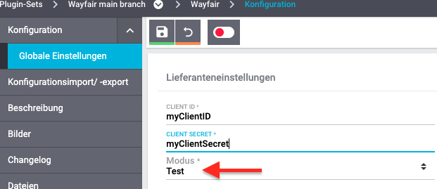

# Wayfair Plugin: Verwendung des Testmodus

## Einführung
Das Wayfair Plugin verfügt über einen Testmodus zur Bewertung seiner Funktionen, ohne die Live-Produktionsdaten in Wayfair-Systemen zu beeinflussen. **Die Einstellung "Modus" gilt ebenso wie die API-Anmeldeinformationen separat für jedes Plugin-Set in Plentymarkets.**

**WICHTIG: Diese Einstellung ändert nichts an der Funktionsweise von Plentymarkets. Die Bestellinformationen können zwischen Plentymarkets- und Wayfair-Systemen variieren.**

## Testmodus aktivieren

1. Wenn Ihre Organisation keine **Wayfair API Sandbox**-Anwendungen hat, erstellen Sie eine neue. Die Prozedur entspricht [den Anweisungen zum Abrufen von Anmeldeinformationen] (Getting_credentials.md), mit der Ausnahme, dass der Schiebeschalter im Anwendungskonfigurationsdialog in der Position `Sandbox` belassen werden sollte. Sie können die Anmeldeinformationen für die neue Sandbox-Anwendung verwerfen. Das Wayfair-Plugin muss seine Produktionsanmeldeinformationen auch im `Test`-modus weiterhin für die ordnungsgemäße Funktionalität verwenden.

2. Verwenden Sie in den [Globale Einstellungen für das Wayfair Plugin](initial_setup.md#1-autorisieren-des-wayfair-plugins-für-den-zugriff-auf-wayfair-schnittstellen) im aktiven Plugin-Set den Einstellungswähler `Modus` zum Einstellen auf `Test`.

      

3. Speichern Sie die `Globale Einstellungen` für das Wayfair-Plugin.

4. Melden Sie sich bei Plentymarkets ab und wieder an, um sicherzustellen, dass die Einstellungen wirksam werden.

## Technische Details
* Wenn Sie den `Test`-modus verwenden, wird eine Interaktion mit Wayfair, die normalerweise den Status der Wayfair-Bestelldaten ändern würde, mit einer `dryMode` Flag angefordert. Dies weist Wayfair-Systeme an, während der Verarbeitung der Anfrage keine Daten zu ändern.

* **Obwohl der `Test`-Modus derzeit nicht die Wayfair-API-Sandbox verwendet, können Änderungen an API-Sandbox-Daten das Verhalten des Wayfair-Plugins im `Test`-Modus beeinflussen.**
