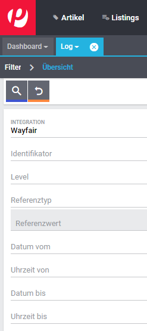

# Wayfair Plugin: Fehlerbehebung

## Einführung

Dieses Dokument richtet sich an Benutzer des Wayfair-Plugins, bei denen Probleme auftreten. Wenn es in Plentymarkets ein Problem gibt, das nicht speziell für das Wayfair-Plugin gilt, sollte es Plentymarkets gemeldet werden.

Die bekannten Probleme für aktuelle und frühere Versionen des Wayfair-Plugins können auf [Die Issues Site auf Github](https://github.com/wayfair-contribs/plentymarkets-plugin/issues) eingesehen werden.

## Plentymarkets logs

The Wayfair plugin produces information in the Plentymarkets logs, which contains critical information for investigating and resolving issues.

### Anzeigen der Logs
Um die Plentymarkets-Protokolle anzeigen, Gehen Sie von der Hauptseite von Plentymarkets aus zu `Daten` >> `Log`.

### Legen Sie die Log Level für Wayfair fest

Die Standardeinstellungen für die Logs zeigen nicht alle Nachrichten vom Wayfair-Plugin an. Um weitere Details in den Protokollen zu erhalten, ändern Sie die Log Level für Wayfair in `Debug`:

1. Laden Sie die Plentymarkets `Log` Seite, falls sie noch nicht geöffnet ist.

2. Drück den zahnradförmiger Knopf  für `Logs Konfigurieren`.

3. Klicken Sie in der linken Liste auf `Wayfair`.
    

4. Aktivieren Sie das Kontrollkästchen `Aktiv`.

5. Stellen Sie die `Log level` auf `Debug` ein.

6. Make sure the settings look like this:

    

7. Klicken Sie unten im Formular auf die Schaltfläche `Speichern`, um die Einstellungen zu speichern. **Hinweis:** Es gibt keinen Hinweis darauf, dass die Einstellungen gespeichert wurden.

### Nur die Wayfair-Protokolle anzeigen

1. Laden Sie die Plentymarkets `Log` Seite, falls sie noch nicht geöffnet ist.

2. Geben Sie im Feld `Integration` auf der linken Seite "Wayfair" ein.

    

3. Klicken Sie auf die Lupentaste  um nur die Logs für wayfair anzuzeigen.

4. Klicken Sie auf eine Zeile in der Liste der Logs, um weitere Details für eine Nachricht anzuzeigen.

5. Kopieren Sie die Informationen den Log in eine Textdatei, um sie zum Ablegen eines Fehlerberichts zu verwenden.

## Häufige Probleme

Bevor Sie sich an Wayfair wenden, verwenden Sie bitte die folgende Tabelle, um Probleme im Wayfair-Plugin selbst zu diagnostizieren.

| Problem | Mögliche Ursachen |
| ----- | --------------- |
| Allgemeiner Mangel an Daten, die von Wayfair stammen oder zu Wayfair gehen | <ul><li>[Anmeldeinformationen für das Plugin](initial_setup.md#1-autorisierung-des-wayfair-plugins-f%C3%BCr-den-zugriff-auf-wayfair-schnittstellen) fehlen oder sind im aktiven Plugin Set falsch.</li><li>Probleme mit der Internetverbindung.</li><li>Vorübergehende Ausfallzeiten bei Wayfair.</ul> |
| In dem an Wayfair gesendeten Inventar fehlt ein Artikel | <ul><li>Die Einstellung [`Item Mapping Method`](settings_guide.md#item-mapping-method) in den Einstellungen von Wayfair Plugin ist nicht auf den gewünschten Wert eingestellt.</li><li>Die Einstellung [`Vollständigen Bestand an Wayfair senden`](settings_guide.md#vollst%C3%A4ndigen-bestand-an-wayfair-senden) ist **deaktiviert** **disabled** und die Artikelvariation in Plentymarkets ist nicht [als für den Wayfair-Marktplatz verfügbar markiert](initial_setup.md#5-artikel-auf-wayfair-zum-verkauf-anbieten).</li><li>Die Artikelvariation in Plentymarkets ist einem Plentymarkets Lager zugeordnet, das keiner Wayfair Lieferanten ID auf der [Lager Seite](settings_guide.md#die-lager-seite) der Wayfair Plugin Einstellungen zugeordnet ist.</li><li>Die Artikelvariation in Plentymarkets hat einen leeren oder falschen Wert in dem Feld, das der Einstellung [`Item Mapping Method`](settings_guide.md#item-mapping-method) der Wayfair Plugin Einstellungen ausgewählt ist.</li></ul> |
| Ein an Wayfair gesendeter Inventarbetrag für einen Artikel liegt unter dem erwarteten Wert | <ul><li>Keines der [Plentymarkets Lager abgestimmt auf Wayfair](settings_guide.md#die-lager-seite) hat positive Lagerbestände für den Plentymarkets Artikelvariation.</li><li>Der Wert der [Lagerpuffer](settings_guide.md#lagerpuffer) ist größer oder gleich der Bestandsmenge für die Plentymarkets Artikelvariation in [Plentymarkets Lager abgestimmt auf Wayfair](settings_guide.md#die-lager-seite).</li></ul> |
| Es kommen keine Bestellungen von Wayfair | <ul><li>Die Wayfair Lieferanten ID für die Wayfair-Bestellung nicht ist einem Plentymarkets Lager zugeordnet auf der [Lager Seite](settings_guide.md#die-lager-seite) der Wayfair Plugin Einstellungen.</li></ul> |
| Bestellungen von Wayfair werden nicht ordnungsgemäß mit Artikeln in Plentymarkets verknüpft | <ul><li>Die Einstellung [`Item Mapping Method`](settings_guide.md#item-mapping-method) in den Einstellungen von Wayfair Plugin ist nicht auf den gewünschten Wert eingestellt.</li><li>Die Artikelvariation in Plentymarkets hat einen leeren oder falschen Wert in dem Feld, das der Einstellung [`Item Mapping Method`](settings_guide.md#item-mapping-method) der Wayfair Plugin Einstellungen ausgewählt ist.</li></ul> |
| Lager zuordnungen fehlen oder sind für Bestellungen von Wayfair falsch | <ul><li>Probleme in Lager verbänden auf der [Lager Seite](settings_guide.md#die-lager-seite) der Wayfair Plugin Einstellungen.</li><li>Derzeit sind einer Wayfair Lieferanten ID mehrere Lager zugeordnet auf der [Lager Seite](settings_guide.md#die-lager-seite) der Wayfair Plugin Einstellungen.</li></ul> |
| Die Schaltfläche zum Herunterladen von Versandetiketten wird nicht auf der Registerkarte `Übersicht` einer Bestellung im `Versand-Center` von Plentymarkets angezeigt | <ul><li>Der Versand der Bestellung wurde nicht registriert.</li><li>Die Seite des `Versand-Center` wurde noch nicht lade de neu, nachdem die Versandregistrierung durchgeführt wurde.</li><li>Das Herunterladen von Dokumenten ist während der Versand Registrierung fehlgeschlagen.</li></ul> |

## Reporting issues to Wayfair

If you are unable to resolve an issue with the Wayfair plugin, you may file a report on [the issues page for the plugin](https://github.com/wayfair-contribs/plentymarkets-plugin/issues) so that it may be evaluated by the Wayfair team.

**When contacting Wayfair, please include information on any settings that have recently been changed in Plentymarkets or in the Wayfair plugin's settings. In order to provide you with the best support, Wayfair's representatives may also need to ask you additional questions about your specific configuration.**
