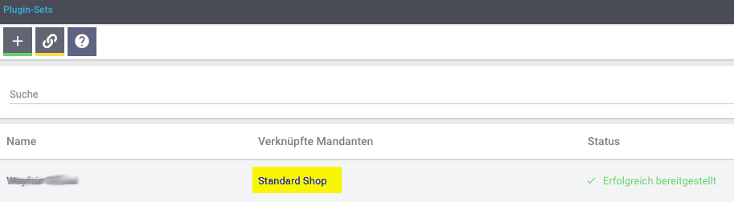

# Wayfair Plugin: Aktualisierung

## Einführung
Das Wayfair-Pluginwird  periodisch aktualisiert werden, um sicherzustellen, dass es den Lieferanten die bestmögliche Erfahrung bietet. **Plentymarkets aktualisiert das Wayfair-Plugin für Benutzer nicht automatisch**, daher müssen Lieferanten dies manuell aktualisieren.

Lesen Sie vor dem Aktualisieren [die neuesten Informationen zu den Versionen des Wayfair Plugin](https://github.com/wayfair-contribs/plentymarkets-plugin/releases).

## Aktualisierung auf die neueste Version des Wayfair Plugins
1. Gehen Sie auf der Hauptseite von Plentymarkets zu `Plugins` >>` Plugin Set Übersicht`
    * **Wählen Sie nicht die veraltete Option `Plugin-Übersicht.`**

        

2. Suchen Sie das Plugin-Set, in dem das Wayfair-Plugin installiert ist.

    * Die Liste der Plugins für das Plugin-Set ist hinter der Schaltfläche `Plugin-Set bearbeiten` versteckt.

        

3. Stellen Sie sicher, dass auf der Seite eine Zeile mit dem Namen "Wayfair" vorhanden ist und dass auch die Spalte `Bereitgestellt` ausgefüllt ist, um anzuzeigen, dass das Plugin verwendet wird.
    

4. Bewegen Sie den Mauszeiger über die Schaltfläche `Aktualisieren`  in der Spalte `Aktionen`.

5. Wenn auf der Schaltfläche die Meldung `Keine Aktualisierung verfügbar` angezeigt wird, verfügen Sie bereits über die neueste Version des Wayfair-Plugins. **Fahren Sie nicht mit dieser Anleitung fort.** Andernfalls sollte `Aktualisierung verfügbar` und eine Versionsnummer angezeigt werden.

      

6. Klicken Sie auf die Schaltfläche `Aktualisieren` . Es wird eine Seite mit dem Wayfair-Logo, Informationen zum Wayfair-Plugin und einer Schaltfläche `Aktualisieren` oben angezeigt.

    

7. Überprüfen Sie die Informationen auf der Seite.

8. Wählen Sie im Dropdown-Menü `Version auswählen` die Option [die neueste Plugin-Version](https://github.com/wayfair-contribs/plentymarkets-plugin/releases), falls diese noch nicht ausgewählt ist.

    

9. Klicken Sie oben auf der Seite auf die Schaltfläche `Aktualisieren` . Nach einer kurzen Pause werden Sie zu den Details des Plugin-Sets weitergeleitet.

10. Stellen Sie sicher, dass auf der Seite eine Zeile mit dem Namen `Wayfair` und der installierten Version als gewünschte Version vorhanden ist

11. Klicken Sie in der Spalte `Aktiv` für die Zeile `Wayfair` auf den Schalter, damit er sich in die aktivierte Position auf der rechten Seite bewegt. **Wenn das Wayfair-Plugin nicht aktiviert wird, sind dessen Funktionen nicht verfügbar**.

12. Stellen Sie sicher, dass die Zeile des Wayfair-Plugins so aussieht.

    

13. Klicken Sie oben auf der Seite auf die Schaltfläche `Plugin-Set bereitstellen` (wird als Schaltfläche "Speichern" angezeigt).

    

14. Während der Installation des Plugins wird ein Fortschrittsbalken angezeigt.

15. Stellen Sie sicher, dass die Spalte für die Zeile `Wayfair` jetzt ausgefüllt ist und den Wert in der Spalte `Installiert` widerspiegelt:

    

16. Melden Sie sich vom Plentymarkets System ab und dann wieder an, um sicherzustellen, dass die Änderungen wirksam werden.
