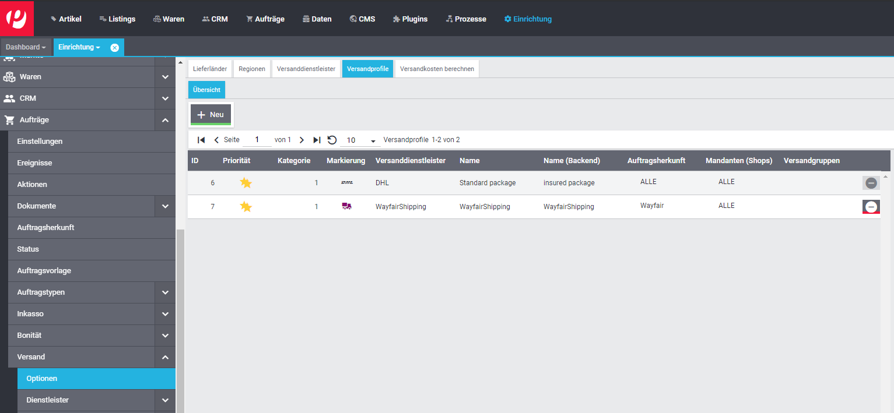
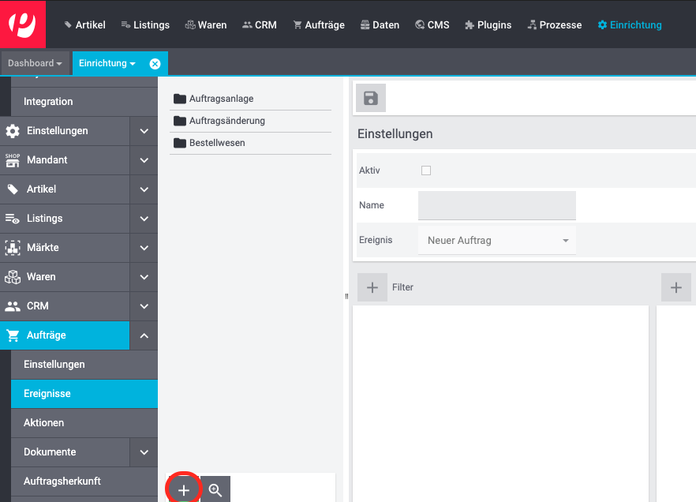
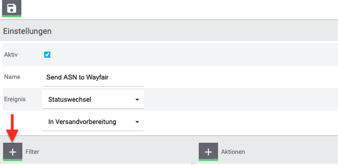
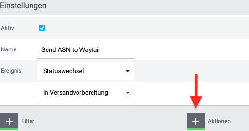
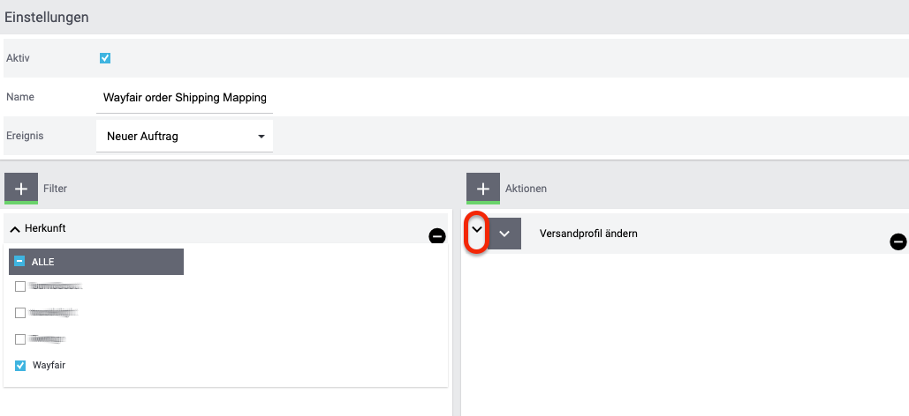

# Wayfair Plugin: Verwenden des Versandkontos von Wayfair

## Einführung

### WayfairShipping Versanddienstleister Typ
Das Wayfair-Plugin bietet einen Typ für Plentymarkets Versanddienstleister. Der Versanddienstleister Typ hat keine konfigurierbaren Einstellungen. Ihre Wayfair-API-Anmeldeinformationen werden verwendet, um versandbezogene Vorgänge auszuführen.

### Versand auf Wayfair's Account
Die Lieferantenpartner von Wayfair können Artikel unter Umständen über ihren bevorzugten Anbieter versenden, haben jedoch auch die Möglichkeit, die Versandanbieter von Wayfair zu verwenden. Dieses Dokument behandelt die Schritte, die zum Einrichten von Plentymarkets erforderlich sind, um die Option `Wayfair Versand` zu verwenden.

## 1. Erstellen des Versanddienstleisters
Um ein Versandprofil für Bestellungen zu erstellen, muss zunächst ein Versanddienstleisterobjekt eingerichtet werden, das das Versandprofil einem Spediteur zuordnet. Führen Sie die folgenden Schritte aus, um den Wayfair-Versanddienstleister zu erstellen:

1. Gehen Sie auf der Hauptseite von Plentymarkets zu `Einrichtung` >> `Aufträge` >> `Versand` >> `Optionen`.

  

2. Wählen Sie die Registerkarte `Versanddienstleister`.

  

3. Klicken Sie auf die Schaltfläche `+ Neu` , um der Tabelle eine neue Zeile hinzuzufügen.

4. Füllen Sie in der neu erstellten Zeile das Feld `Name` aus (der Einfachheit halber empfehlen wir **"WayfairShipping"** für alle Namen).

5. Wählen Sie im Feld `Versanddienstleister` für die Zeile die Option `WayfairShipping` aus. Dies entspricht dem Typ, der vom Wayfair-Plugin bereitgestellt wird. **Alle anderen Felder in der Zeile können leer bleiben.**

6. Stellen Sie sicher, dass die neue Zeile folgendermaßen aussieht:
    

7. Klicken Sie auf "Speichern" .

## 2. Versandprofil erstellen
Jede Bestellung verfügt über ein Versandprofil, das für die Zusammenarbeit mit dem Versanddienstleister verwendet wird, um Artikel aus einer Bestellung zu versenden. Führen Sie diese Schritte aus, um das Wayfair-spezifische Versandprofil einzurichten.

1. Gehen Sie auf der Hauptseite von Plentymarkets zu `Einrichtung` >> `Aufträge` >> `Versand` >> `Optionen`.

    

2. Wählen Sie die Registerkarte `Versandprofile`.

    

3. Wenn bereits eine "Wayfair"-Zeile vorhanden ist, klicken Sie auf diese Zeile. Andernfalls klicken Sie auf die Schaltfläche `Neu`. Die Einstellungen des Versandprofils werden angezeigt.

4. Wählen Sie Ihren Wayfair-Versanddienstleister aus dem bereitgestellten Menü aus (es wird wahrscheinlich **"WayfairShipping"** sein, wenn Sie [den vorgeschlagenen Versanddienstleister](#1-erstellen-des-versanddienstleisters) erstellt haben.

    

5. Füllen Sie die Felder aus, welche sich auf `Name` beziehen. (der Einfachheit halber empfehlen wir **"WayfairShipping"** für alle Namen).

6. Stellen Sie die Sprache über das Menü rechts neben dem Feld `Name` ein.

7. Wählen Sie im Feld `Markierung` das Symbol für Wayfair-Bestellungen aus (`6` und `126` sind gute Optionen, da sie das Wayfair-Farbschema widerspiegeln).

8. Ändern Sie im Feld `Priorität` optional die Priorität (wir empfehlen, sie als Standardpriorität `höchste` zu belassen).

9. Setzen Sie in der Liste `Auftragsherkunft` ein Häkchen neben alle **"Wayfair"** bezogenen Einträge.

  

10. Klicken Sie oben auf der Seite auf die Schaltfläche `Speichern` .

11.Beachten Sie, dass das neue (oder aktualisierte) Versandprofil aufgeführt ist:
   

## 3. Optional kann das Versandprofil automatisch für Wayfair-Bestellungen festgelegt werden

1. Gehen Sie auf der Hauptseite von Plentymarkets zu `Einrichtung` >>` Aufträge` >> `Ereignisse`.

    

2. Klicken Sie auf `Ereignisaktion hinzufügen` (die Schaltfläche `+` unten links auf der Seite), um das Dialogfeld `Neue Ereignisaktion erstellen` zu öffnen.

     

3. Geben Sie einen Namen ein, z.B. **"Wayfair Order Shipping Mapping"**.

4. Wählen Sie das Ereignis `Neuer Auftrag` aus dem Dropdown-Menü.

     

5. Klicken Sie im Dialogfeld auf die Schaltfläche `Speichern` . Das neue Verfahren wird nun ausgewählt, wobei der Abschnitt `Einstellungen` angezeigt wird.

6. Aktivieren Sie im Abschnitt `Einstellungen` der Ereignisaktion das Kontrollkästchen "Aktiv".
    

7. Klicken Sie auf die Schaltfläche `Filter hinzufügen` (die Schaltfläche `+` oben im Abschnitt `Filter`), um das Dialogfeld `Filter hinzufügen` zu öffnen.

    

8. Wählen Sie `Auftrag` >>` Herkunft`.

9. Klicken Sie auf die Schaltfläche `Hinzufügen` , um den Dialog abzuschließen. Auf dem Formular wird nun ein "Herkunft"-Filter angezeigt.

10. Aktivieren Sie in der Liste `Herkunft` das Kontrollkästchen für alle **"Wayfair"** bezogenen Herkunft.
    

11. Klicken Sie auf die Schaltfläche "`Aktion hinzufügen` (die Schaltfläche "+" oben im Abschnitt `Aktionen`), um das Dialogfeld `Aktion hinzufügen` zu öffnen.

    

12. Wählen Sie `Auftrag` >> `Versandprofil ändern`.
    

13. Klicken Sie auf die Schaltfläche `Hinzufügen` [plus add button](../../../images/de/button_plus_add.png), um den Dialog abzuschließen. Im Bereich `Aktionen` wird eine Aktion "Versandprofil ändern" angezeigt.

12. Klicken Sie auf das Symbol `^` (Hochzeichen) ganz links in der Zeile "Versandprofil ändern" **- dies ist NICHT die große quadratische Schaltfläche, auf der sich auch ein Hochzeichen befindet -** um die Details der Prozedur zu erweitern.

    

13. Wählen Sie im Dropdown-Menü der Aktion das [für **Wayfair** erstellte Versandprofil](#2-versandprofil-erstellen).
    

14. Klicken Sie oben auf der Seite auf die Schaltfläche `Speichern` , um die Erstellung der Ereignisprozedur abzuschließen.
