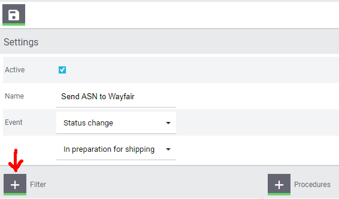
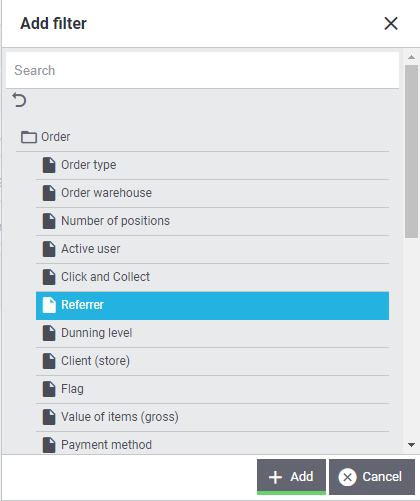
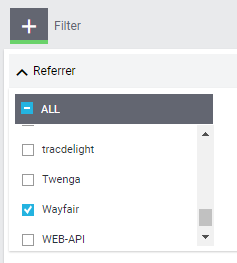

# Wayfair plugin: Initial Setup

## Prerequisites

* [A Plentymarkets system](https://www.plentymarkets.co.uk).

* Administrative rights on the Plentymarkets system where the Wayfair plugin will be used
    - The Plentymarkets user's `Access` setting must be `Admin`
    - The Plentymarkets user must be able to modify Plugin Sets

* Active Wayfair supplier status
    * A Wayfair Supplier ID is required
    * [Information for prospective suppliers](https://partners.wayfair.com/d/onboarding/sell-on-wayfair)

* [Wayfair API credentials](obtaining_credentials.md).

* [Installation of the Wayfair plugin](plugin_installation.md).

## 1. Authorizing the Wayfair Plugin to access Wayfair interfaces
After the plugin is installed in your Plentymarkets Plugin Set, the plugin must be configured to use the correct credentials when connecting to Wayfair's interfaces.

* **The authorization procedure must be performed for any Plugin Set that contains the Wayfair plugin**.

* Copying a Plugin Set will copy the authorization information to the new plugin set.

* An exported or imported Plugin Set may include the authorization information.

The authorization steps are as follows:
1. From the main Plentymarkets page, go to `Plugins` >> `Plugin set overview`:

    

2. Locate the Plugin Set that is linked to the client with which Wayfair will be used:

    

3. Click on the `Edit` button  for the desired Plugin set.

4. In the Wayfair row of the Plugin set, click on the `Settings` button .

4. In the left-side menu, go to `Configuration` >> `Global Settings`:

    

5. In the `Supplier Settings` area, enter the `Client ID` and `Client Secret` values that correspond with your Wayfair API credentials.

6. Change the `Mode` setting to `Live` - see [information on `Test` mode](test_mode.md):

    

7. Click the `Save` button  in the toolbar above the settings

## 2. Activating the order referrer
An order referrer in Plentymarkets identifies the sales channel on which an order was generated. To get the Plentymarkets system to properly import orders from the Wayfair API, the Wayfair order referrer must be activated:

1. From the main Plentymarkets page, go to `Setup` >> `Orders` >> `Order referrer`:

    

2. Place a check mark next to the `Wayfair` order referrer:

    

3. Click the `Save` button .

## 3. Setting up Plentymarkets for shipping through Wayfair
To ensure proper integrations with Wayfair when shipping order items, follow the procedures outlined in  [the Wayfair Shipping instructions](wayfair_shipping.md).

## 4. Matching items ordered on Wayfair with Item Variations in Plentymarkets:
In order to properly handle incoming orders from Wayfair, the Wayfair plugin must match the Supplier Part Numbers in Wayfair's systems with a specific field of Item Variations in Plentymarkets. By default, the Wayfair plugin operates on the assumption that the `Variation Number` **(not to be confused with the Variation's ID)** of an Item's Variation in Plentymarkets will match the Wayfair Supplier Part Number.

If the Wayfair Supplier Part Numbers for your organization are to be reflected in an alternative field in your Plentymarkets Item Variations, change the value of [the `Item Mapping Method` setting](settings_guide.md#item-mapping-method) and update the Variations accordingly.

## 5. Making items available for sale on Wayfair
Items that you want to sell on the Wayfair market must be considered active in Plentymarkets. The Plentymarkets user may also choose to limit which Items are for sale on Wayfair. **Note that Inventory and ordered items are controlled at the `Variation` level.**

This procedure is required only if [the `Send all inventory items to Wayfair` setting](settings_guide.md#send-all-inventory-items-to-wayfair) is **disabled.**:

1. From the main Plentymarkets page, go to `Item` >> `Edit item`

2. Search for item(s) and open them

3. **For each item**, click `Variations` and open them

4. **For each Variation**:

    1. On the `Settings` tab, make sure that the `Active` checkbox in the `Availability` Section is checked:

        

    2. If [the `Send all inventory items to Wayfair?` setting](settings_guide.md#send-all-inventory-items-to-wayfair) is **disabled**, go to the `Availability` tab of the Variation and add "Wayfair" to the list in the `Markets` area:

        

    3. Click the `Save` next to the Variation `ID` (not the higher-up button for the Item):

        

## 6. Configuring the Warehouse mappings to match Wayfair Supplier IDs.

In order to update the inventory data in Wayfair's system, you need to map the Warehouses in your Plentymarkets system to the Supplier IDs in Wayfair's system, on the [Warehouses](settings_guide.md#warehouses-page) page of [the plugin's settings](settings_guide.md).

## 7. Configuring Plentymarkets to send Confirmation of Delivery (ASN) to Wayfair

### 7.1 Setting the Wayfair Plugin to send the correct shipping information to Wayfair
Wayfair Plugin users that wish to ship orders by using their own accounts (rather than using Wayfair's shipping services) must update the [Ship Confirmation (ASN) configuration settings](settings_guide.md#ship-confirmation-asn-page) to reflect their specific configuration.

If Wayfair's shipping services are to be used, the Wayfair plugin's ASN settings should be left in their default (`Wayfair Shipping`) state.

### 7.2 Creating an Event for Plentymarkets Orders that sends shipment information to Wayfair

1. From the main Plentymarkets page, go to `Setup` >> `Orders` >> `Events`:

    

2.	Click on `Add event procedure` (the `+` button on the bottom left-hand side of the page):

    

3.	Enter any `Name` in the appropriate field.

4.	Select `Status change` (in the category `Order Change`) in the `Event` field:

    

5.	In the field below `Event` select the status change that should initiate the sending of an ASN to Wayfair, such as `In preparation for shipping`:

    

6.	Click the `Save` button .

7.	You should automatically be redirected to the newly created event procedure. In the `settings` section of the event procedure, place a checkmark next to `Active`:

    

8. Click on `Add Filter`:

    

9.  Choose `Referrer` in the `Order` category:

    

10. Click the `Add` button .

11.	In the `Filter` section, a box should appear with a list of all available Order referrers. Place a checkmark next to all "Wayfair" order referrers:

    

12. Click on `Add procedure`:

    

13. Choose `Send Ship Confirmation (ASN) to Wayfair` in the `Plugins` category:

    

14. Click the `Add` button .

15. Verify that the Event's settings finally look similar to this:

    

16. Click the `Save` button .

## 8. Performing the first inventory synchronization
Once everything has been set up, the it is time to start listing items for sale on Wayfair.

Finalize the setup by initiating a full inventory synchronization on the [Full Inventory](settings_guide.md#full-inventory-page) page of the [Wayfair Market Settings](settings_guide.md).

**After this first inventory synchronization, the Wayfair plugin will periodically send inventory updates to Wayfair, without any further manual activations.**
