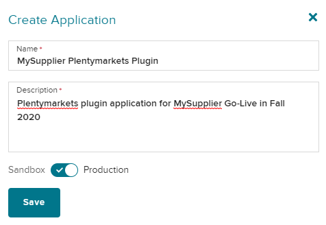
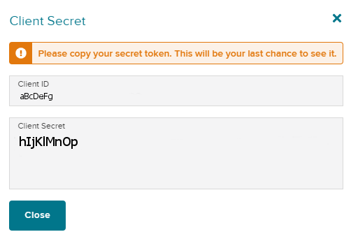

# Wayfair plugin: Getting API Credentials

In order for the Wayfair plugin to connect to Wayfair's systems, you need to provide your unique API credentials.

To receive the API credentials for you organization, follow these steps:

## 1. Send an Email to Wayfair

Please send an email to your Wayfair Account Manager, and copy (CC) ERPSupport@wayfair.com to request assistance:

- Subject : Access to Plentymarkets plugin / (Name of your company) (Wayfair Supplier ID)
- Body:
    - Your contact information.
    - Short description of how you intend to use the Plentymarkets plugin.
    - Date when you are ready to use the Wayfair Plentymarkets Plugin.

You will promptly receive a response containing these details:
- Confirmation of your API access being set up.
- Supplier ID(s) for your Warehouses.

## 2. Generate Application Credentials

1. Go to https://partners.wayfair.com/developer/applications

2. Enter your Wayfair Partner Home credentials. You should be redirected to the `Application Management` page for Wayfair.

3. On the `Application Management` page, click the `New Application` button at the bottom of the page: 

4. On the `Create Application` form, provide the new application's details:
    *  `Name`: A useful identifier such as "[My Supplier] Plentymarkets plugin."
    * `Description`: something like "Plentymarkets plugin application for [My Supplier] Go-Live in Fall 2020".

5. Use the slider switch at the bottom of dialog to set it to `Production`, unless otherwise instructed by Wayfair.

6. Confirm that the `Create Application` form looks like this:

7. Click `Save` on the `Create Application` dialog, which will display the application's credentials - `Client ID` and `Client Secret`:

8. Copy the `Client ID` and `Client Secret` to a secure location.
    * **The `Client Secret` cannot be retrieved after this point and a new one must be generated if the original is lost.**

    * These credentials will be used for [authorizing the Wayfair plugin](initial_setup.md#1-authorizing-the-wayfair-plugin-to-access-wayfair-interfaces) for use of Wayfair's systems.

9. Close the credentials dialog to protect the information.

10. Review the [supplementary information on credentials](tips_and_tricks.md#protecting-your-credentials).
