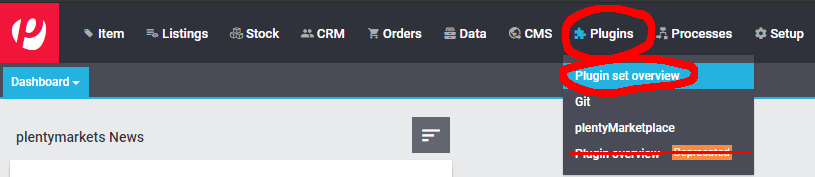
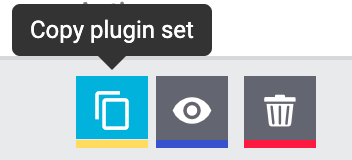

# Wayfair plugin: Installation instructions
The Wayfair plugin is available for **free** on the official plentyMarketplace from Plentymarkets. This document covers the steps required for making it available for use in a Plentymarkets system.

## 1. Making the Wayfair plugin available in Plentymarkets
Plentymarkets systems do not come with the Wayfair plugin by default.
Follow these steps to make it available for use:

1. Log in to the Plentymarkets system.

2. From the main Plentymarkets page, go to `Plugins` >> `plentyMarketplace`, which will use the Plentymarkets system's owner’s credentials to log you in on the plentyMarketplace website:

    

3. Click the search button in the top-right corner of the page.

4. Enter **"Wayfair"** into the box and press enter.

5. If a `You have purchased this plugin` banner appears on the top page and/or an `Already purchased` appears on the page, skip to the instructions on [installing the plugin in a Plugin Set](#2-installing-the-wayfair-plugin-in-a-plugin-set).

6. Click the `Go to checkout` button.

7. Complete all fields on the purchasing form.

8. Accept terms and conditions.

9. Click `Order now` and await confirmation. The plugin will be soon be available in the system.

## 2. Installing the Wayfair plugin in a Plugin Set
To use the functions of the Wayfair plugin, it must be installed in the Plentymarkets system's active plugin set(s). Follow these instructions to complete the installation:

1. From the main Plentymarkets page, go to `Plugins` >> `Plugin set overview`

    

    * **Do not select the deprecated, similarly named `Plugin overview` option, if it appears in the menu.**

    * The screen should show a list of plugin sets, with a set of buttons for each one.

2. Create the Plugin Set where the plugin is to be installed, if it the desired Plugin Set does not yet exist.

    * If you already have other plugins installed, you may wish to use a copy of an existing Plugin Set via its dedicated `Copy plugin set` button: 

    * Your Plentymarkets license may limit the number of Plugin Sets that can exist at one time.

3. Configure the Plugin Set(s) to be used by Plentymarkets
    * The `Linked clients` field for the Plugin Set should contain the names of all Plentymarkets Shop(s) for which Wayfair plugin functionality is desired:

        

    * Optionally use the `Link clients and plugin sets` button to modify the linkages between clients and Plugin Sets:

        

4. Click the `Edit plugin set` button  for the Plugin Set in which the Wayfair plugin is to be installed.

5. Click the `Add plugin` button:

    

6. `Wayfair` should appear in the list of plugins. If there are many plugins, type "wayfair" into the `Search` box:

    

7. Click on the `Wayfair` entry in the list. If you have previously installed the Wayfair plugin via the "git" channel, there may multiple entries for "Wayfair." Please select the entry that has the `Marketplace` source ().

8. Review the information on the page:

    

9. In the `Select version` drop-down menu, choose [the newest plugin version](https://github.com/wayfair-contribs/plentymarkets-plugin/releases) if it is not already selected.

10. Click the `Install` button  at the top of the page. You will be redirected to the individual Plugin Set's details.

11. Verify that a row exists on the page with the `Name` displayed as "Wayfair" and the `Installed` version showing as the desired version

12. In the `Active` column for the "Wayfair" row, click on the switch so that it moves to the right-side, enabled position. **Failure to activate the Wayfair plugin will prevent its functionalities from being available**.

13. Verify that the Wayfair plugin's row looks like this:

    

14. Click the `Deploy plugin set` button (appears as a Save button):

    

15. A progress bar will appear while the plugin is installed.

16. Confirm that the `Deployed` column for the "Wayfair" row is now populated, and it reflects the value in the `Installed` column:

    

17. Log out of the Plentymarkets system, then log back in, to ensure that the changes are now in effect.
