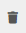

# Wayfair Plugin: Settings

## Warehouses page
The Warehouses page is used for associating the Warehouses that the supplier is using in Plentymarkets with the Wayfair Supplier IDs that have been issued to the supplier. The mappings are utilized by the Wayfair plugin when it reports inventory to Wayfair and also when ti is processing Wayfair orders coming into Plentymarkets.

The topography of the Plentymarkets system may not match the amount of Wayfair Supplier IDs. It is acceptable to use a Warehouse Supplier ID for more than one of the Plentymarkets Warehouses. Beware the [Stock Buffer](#stock-buffer) setting.

### Adding a Warehouse mapping
1. Click on the `Add Mapping` button
2. Use the left column to choose a Plentymarkets Warehouse by name
3. Use the right column to enter a numeric Supplier ID
4. Click the `Save` button once the new row(s) have been completed

### Removing a Warehouse mapping
1. Locate the row to be removed
2. Click on the `delete` button  in the row
3. Click the `Save` button once the desired row(s) have been removed

## Settings page
The Settings page contains general settings for the operation of the Wayfair plugin.

### Stock Buffer
The `Stock Buffer` setting is a non-negative integer that sets a reserved amount of stock for each Item Variation, for each Wayfair Supplier ID. The buffer amount is subtracted after all other stock calculations are made, including aggregating the stocks for multiple Plentymarkets Warehouses that have been assigned the same Wayfair Supplier ID.

To disable the `Stock Buffer`, leave this setting empty, or set it to `0`.

### Default Order Status
...
