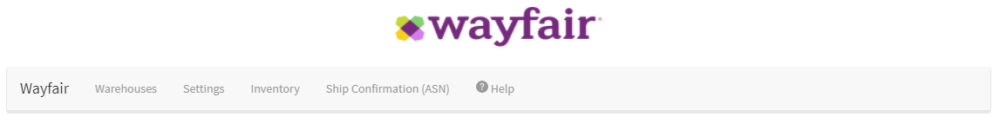
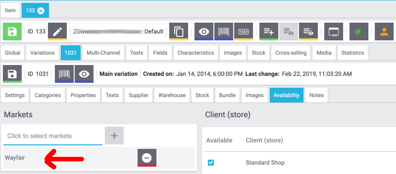

# Wayfair Plugin: Wayfair Market Settings
The Wayfair plugin comes with a collection of settings for controlling the plugin's behavior.
These settings should only be configured after the [authorization settings for the plugin](initial_setup.md#1-authorizing-the-wayfair-plugin-to-access-wayfair-interfaces) have been configured for the active Plugin Set.

## Opening the settings page
To locate the settings:
1. Log in to Plentymarkets as a user with administrative rights
2. Click `Setup` in the top navigation bar of Plentymarkets:

    

3. Click `Markets` in the left navigation bar of the `Settings` interface

    

4. Click `Wayfair` in the list of `Markets`. It may appear at the bottom, rather than being alphabetically situated.

5. Click `Home` under `Wayfair`

    

6. You may now use the Wayfair navigation bar to choose a settings page such as [`Warehouses`](#warehouses-page).

    

## Home page
The `Home` page is activated by clicking `Home` in the left-side menu or by clicking `Wayfair` in the Wayfair navigation bar. Currently, it provides no information.

## Warehouses page
The Warehouses page is used for associating the Warehouses that the supplier is using in Plentymarkets with the Wayfair Supplier IDs that have been issued to the supplier. The mappings are utilized by the Wayfair plugin when it reports inventory to Wayfair and also when it is processing Wayfair orders coming into Plentymarkets.

### Notes about Multiple Warehouses per Wayfair Supplier ID
The topography of the Plentymarkets system may not match the amount of Wayfair Supplier IDs. It is acceptable to use a Wayfair Supplier ID for more than one of the Plentymarkets Warehouses, but **this may cause unexpected behavior.** For instance, **the Wayfair plugin may not be able to determine the correct Warehouse to use for incoming orders** - see https://github.com/wayfair-contribs/plentymarkets-plugin/issues/92 for more information.

When choosing a relationship between Warehouses and Supplier IDs that is not one-to-one, make sure to review the behavior of the [Stock Buffer](#stock-buffer) setting.

### Adding a Warehouse mapping
1. Click on the `Add Mapping` button .

2. Use the left column to choose a Plentymarkets Warehouse by name
3. Use the right column to enter a numeric Supplier ID
4. Click the `Save` button  once the new row(s) have been completed.

### Removing a Warehouse mapping
1. Locate the row to be removed
2. Click on the `delete` button  in the row
3. Click the `Save` button  once the desired row(s) have been removed.

## Settings page
The Settings page contains general settings for the operation of the Wayfair plugin.
Settings do not automatically save when changed. Use the `Save` button  at the bottom of the page.

### Stock Buffer
The `Stock Buffer` setting is a non-negative integer that sets a reserved amount of stock for each Item Variation, for each Wayfair Supplier ID. The buffer amount is subtracted after all other stock calculations are made, including aggregating the stocks for multiple Plentymarkets Warehouses that have been assigned the same Wayfair Supplier ID.

To disable the `Stock Buffer`, leave this setting empty, or set it to `0`.

### Default Order Status
The `Default Order Status` setting determines which state a new Plentymarkets Order should be in after creation by the Wayfair plugin.

**Notice:** The Order creation does not qualify as an Order state change. Setting `Default Order Status` to a value higher than configured Plentymarkets Order Actions may prevent said Actions from taking place!

### Default Shipping Provider **(deprecated)**
The `Default Shipping Provider` setting is a legacy setting that no longer impacts the behavior of the plugin.
**If this setting appears in your system, Wayfair strongly recommends that you upgrade your plugin to a newer version.**

### Item Mapping Method
The `Item Mapping Method` setting determines the behavior for matching the Plentymarkets Item Variations to the Wayfair Products. It is used when the inventory listings are sent to Wayfair, and also to select the requested products in a Wayfair Purchase Order. The Plentymarkets user should configure this setting to match the way their Item Variations are populated.

### Using Variation Number as the Item Mapping Field
By default, the `Variation Number` field is used for mapping Wayfair Orders' items to Plentymarkets Item Variations:

The other options are `EAN` (Barcode) and `SKU`.

#### Using EAN (Barcode) as the Item Mapping Method
When the `Item Mapping Method` is set to `EAN`, each Item Variation in Plentymarkets should be set up to have a Barcode that mirrors the Wayfair Supplier Part Number that Wayfair will send in incoming order data:

1. From the main Plentymarkets page, go to `Item` >> `Edit Item`

2. Search for items to be sold on Wayfair

3. **For each Item**, click on the item in the search results, then click `Variations`

4. **For each Variation**:
    1. Click on the `Settings` tab

    2. In the `Barcode` section, pick a barcode type.

    3. Click the `Add` button , then enter the barcode value in the `Code` field. The Barcode should match the Wayfair Supplier Part Number.

    4. Click the `Save` button  at the Variation level (not to be confused with the `Save` button for the Item, a few rows above)

#### Using SKU as the Item Mapping Method
When the `Item Mapping Method` is set to `SKU`, each Item Variation in Plentymarkets should be set up to have a Wayfair-specific SKU that mirrors the Wayfair Supplier Part Number that Wayfair will send in incoming order data:

1. From the main Plentymarkets page, go to `Item` >> `Edit Item`.

2. Search for items to be sold on Wayfair.

3. **For each Item**, click on the item in the search results, then click `Variations`.

4. **For each Variation**:
    1. Click on the `Availability` tab.

    2. In the `SKU` section, click the `Add` button button .

    3. In the pop-up window, choose `Wayfair` for the `Referrer` then enter the Wayfair Supplier Part Number in the `SKU` field.

    4. Click `Add` .

    5. Click the `Save` button  at the Variation level (not to be confused with the `Save` button for the Item, a few rows above)

### Import orders since
The optional `Import orders since` setting determines a date on which new Wayfair purchase orders are considered eligible for being imported into the Plentymarkets system. This setting can improve performance by preventing the Wayfair plugin from requesting orders created before the specified date. It can also be used to prevent the Plentymarkets system from accepting Orders prior to the desired "go-live date."

### Send all inventory items to Wayfair?
The optional `Send all inventory items to Wayfair?` setting determines if Plentymarkets Item Variations must be explicitly declared as eligible for sale on Wayfair or not.
When `Send all inventory items to Wayfair?` is disabled, selling an Item on Wayfair requires having "Wayfair" present in the `Markets` list of the `Availability` tab of each  Variation to be sold on Wayfair, as seen in this example:

Enabling `Send all inventory items to Wayfair?` will allow Wayfair to list any item that is determined to be currently in stock, including those Item Variations for which "Wayfair" is **not** present in the `Markets` list.

## Inventory page
**(Since 1.1.4)**

The 'Inventory' page does not contain any settings to configure.
It is used for checking the status of syncing the Plentymarkets inventory with Wayfair.
The page's data refreshes on a regular basis, as denoted by the timestamp toward the bottom.

### Main synchronization status

The top of the `Inventory` page always displays an icon and message to describe the overall health of the inventory synchronization process.

* A calendar icon  will appear if the Wayfair plugin has yet to attempt inventory synchronizations.

    * This happens right after the plugin is installed.
    * This may happen if the plugin was recently upgraded.
    * The page will change within 15-30 minutes, as the synchronization system initializes.

* An icon with a checkmark  will appear if the Wayfair plugin is regularly synchronizing inventory without detecting any issues.

* An icon with a crossed-out cloud  will appear if the Wayfair plugin detects irregularities in inventory synchronization.

    * Errors are expected if the Wayfair plugin was recently installed and [the setup process](initial_setup.md) has not been completed yet. Finish setting up the plugin prior to using the `Inventory` page again.
    * Details may appear lower on the page, to help explain what is wrong.
    * View the [Plentymarkets logs](troubleshooting.md#plentymarkets-logs) to obtain error details.
    * View the Wayfair plugin's [troubleshooting guide](troubleshooting.md) for ideas on how to solve inventory synchronization issues.

### Synchronization details

When it is possible to do so, the `Inventory` page will provide details to support the main status that is displayed at the top of the page.

* A calendar icon  indicates a piece of information that is not yet available.
* An icon with a checkmark  indicates a positive event.
* An icon with a crossed-out cloud  indicates a negative event.
* An icon with an arrow pointing upwards to a cloud  indicates that an event is currently happening and will be reported on once it has been completed.

## Full Inventory page
**(Removed in 1.1.4)**

The `Full Inventory` page has been replaced by the [`Inventory`](#inventory-page) page. **If you are using a version of the Wayfair Plugin that contains the `Full Inventory` page, Wayfair recommends that you upgrade the plugin as soon as possible.**

Detailed information about the `Full Inventory` page can be found in [the documentation for version 1.1.3](https://github.com/wayfair-contribs/plentymarkets-plugin/blob/release-1.1.3/meta/documents/user_guide/en/settings_guide.md#full-inventory-page).

## Ship Confirmation (ASN) page
The `Ship Confirmation (ASN)` page is used for configuring the shipment interactions between Plentymarkets, the Wayfair Plugin, and Wayfair.
The information set here will inform the `Send Ship Confirmation (ASN) to Wayfair` Order Procedure that the Wayfair Plugin provides.

### Shipping type
The radio button at the top of the page has these options.
During Wayfair plugin onboarding, Wayfair will instruct on which option is appropriate for the Plentymarkets user.
* `Wayfair shipping`
    * Your orders' shipments are arranged by Wayfair, to be shipped by a carrier chosen by Wayfair
    * Your Plentymarkets system needs to Wayfair when the order is ready for shipment
    * You Plentymarkets system needs to get tracking information back from Wayfair

* `Own account shipping`
    * You ship your own orders via your own carriers
    * Your Plentymarkets system needs to tell Wayfair when you are shipping an order
    * Your Plentymarkets system needs to tell Wayfair the tracking information (carrier and tracking number)

### Matching Plentymarkets Carriers to Wayfair Carriers
When you choose the `Own Account shipping` option, Wayfair needs to translate the Plentymarkets shipping information into data it understands.
1. Locate the carrier information provided by Wayfair. Contact [ERPSupport@wayfair.com](mailto:ERPSupport@wayfair.com) if required.
2. For each Plentymarkets-side `Shipping Carrier` listed on the left-side column, enter the Wayfair-provided "SCAC code" in the right-side `Wayfair carrier` column.
3. Click `Save`  at the bottom of the page.
