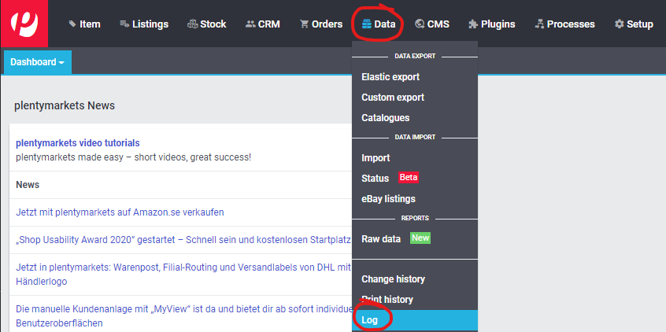
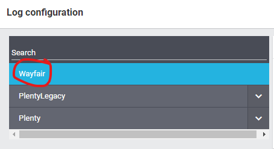
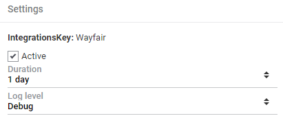
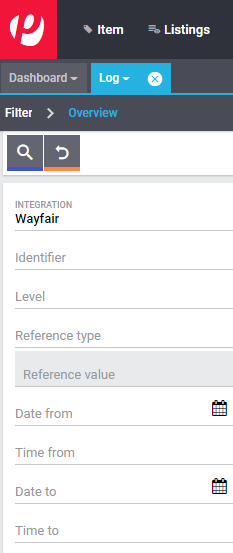

# Wayfair Plugin: Troubleshooting

## Introduction

This document is intended for users of the Wayfair plugin who are experiencing issues with it. If there is an issue in Plentymarkets which does not apply specifically to the Wayfair plugin, it should be reported to Plentymarkets.

The known issues for current and past versions of the Wayfair plugin can be viewed on [the plugin's github page](https://github.com/wayfair-contribs/plentymarkets-plugin/issues).

## Plentymarkets logs

The Wayfair plugin produces information in the Plentymarkets logs, which contains critical information for investigating and resolving issues.

### Viewing the logs
To view the Plentymarkets logs, from the main Plentymarkets page, go to `Data` >> `Log`.

### Setting the log level for Wayfair

The default settings for the logs do not show all messages from the Wayfair plugin. To get more details in the logs, change the level of logging for Wayfair to `Debug`:

1. Open the Plentymarkets `Log` page if it is not already open.

2. Click on the `Configure Logs` gear-shaped button .

3. Click on `Wayfair` in the list on the left.
    

4. Check the `Active` box

5. Set the `Log level` to  `Debug`

6. Ensure the settings look like this:

    

7. Click the `save` button at the bottom of the form to save the settings. **Notice:** There is no indication that the settings have saved.

### Filtering the logs to show only Wayfair logs

1. Open the Plentymarkets `Log` page if it is not already open.

2. In the `Integration` field on the left side of the log viewer, enter "Wayfair"

    

3. Click on the magnifying glass button  to display only the Wayfair Plugin's log messages.

4. Click on a row in the logs view in order to view more details for a message.

## Common issues

Prior to contacting Wayfair, please use the table below to self-diagnose issues in the Wayfair plugin.

| Issue | Possible causes |
| ----- | --------------- |
| General lack of data coming from Wayfair or going to Wayfair | <ul><li>Missing or incorrect credentials for the Wayfair Plugin in the active Plugin Set.</li><li>Internet connectivity issues</li><li>Temporary Wayfair downtime.</ul> |
| Items missing from inventory sent to Wayfair | <ul><li>The [`Item Mapping Method`](https://github.com/wayfair-contribs/plentymarkets-plugin/blob/main/meta/documents/user_guide/en/settings_guide.md#item-mapping-method) setting in Wayfair's settings is set to the incorrect value.</li><li>The [`Send all inventory items to Wayfair`](https://github.com/wayfair-contribs/plentymarkets-plugin/blob/main/meta/documents/user_guide/en/settings_guide.md#send-all-inventory-items-to-wayfair) setting is **disabled** and the Variation in Plentymarkets is not marked as available for the Wayfair marketplace.</li><li>The item is associated with a Plentymarkets Warehouse that is not mapped to a Wayfair Supplier ID on the [`Warehouses`](https://github.com/wayfair-contribs/plentymarkets-plugin/blob/main/meta/documents/user_guide/en/settings_guide.md#warehouses-page) page of the Wayfair settings.</li><li>There is an empty value in the field of the Plentymarkets Variation that is associated with the [`Item Mapping Method`](https://github.com/wayfair-contribs/plentymarkets-plugin/blob/main/meta/documents/user_guide/en/settings_guide.md#item-mapping-method) setting in Wayfair's settings.</li><li>The amount of inventory for the item in Warehouses assigned to Wayfair Supplier IDs is 0, or the total amount is lower than the [`Stock Buffer`](https://github.com/wayfair-contribs/plentymarkets-plugin/blob/main/meta/documents/user_guide/en/settings_guide.md#stock-buffer) setting.</li></ul>
| No orders coming from Wayfair | <ul><li>The Wayfair Supplier ID for the Wayfair Purchase Order is not mapped to a Plentymarkets Warehouse on the [`Warehouses`](https://github.com/wayfair-contribs/plentymarkets-plugin/blob/main/meta/documents/user_guide/en/settings_guide.md#warehouses-page) page of the Wayfair settings.</li></ul> |
| Orders coming from Wayfair are not properly getting associated with Items in Plentymarkets | <ul><li>The [`Item Mapping Method`](https://github.com/wayfair-contribs/plentymarkets-plugin/blob/main/meta/documents/user_guide/en/settings_guide.md#item-mapping-method) setting in Wayfair's settings is set to the incorrect value.</li><li>There is an empty or incorrect value in the field of the Plentymarkets Variation that is associated with the [`Item Mapping Method`](https://github.com/wayfair-contribs/plentymarkets-plugin/blob/main/meta/documents/user_guide/en/settings_guide.md#item-mapping-method) setting in Wayfair's settings.</li></ul> |
| Warehouses missing or incorrect for Order coming from Wayfair | <ul><li>Warehouses are not assigned to Wayfair Supplier IDs on the [`Warehouses`](https://github.com/wayfair-contribs/plentymarkets-plugin/blob/main/meta/documents/user_guide/en/settings_guide.md#warehouses-page) page of the Wayfair settings.</li><li>Multiple Warehouses associated with one Wayfair Supplier ID on the [`Warehouses`](https://github.com/wayfair-contribs/plentymarkets-plugin/blob/main/meta/documents/user_guide/en/settings_guide.md#warehouses-page) page of the Wayfair settings.</li></ul> |
| Shipping label download button does not appear in the "Overview" tab of an Order in the Plentymarkets Shipping centre | <ul><li>Order's shipment has not been registered.</li><li>Shipping Centre was not yet refreshed after shipment registration was performed.</li><li>Document downloading failed during the shipment registration process.</li></ul> |

## Reporting issues to Wayfair

If you are unable to resolve an issue with the Wayfair plugin, you may file a report on [the issues page for the plugin](https://github.com/wayfair-contribs/plentymarkets-plugin/issues) so that it may be evaluated by the Wayfair team.

**When contacting Wayfair, please include information on any settings that have recently been changed in Plentymarkets or in the Wayfair plugin's settings. In order to provide you with the best support Wayfair's representatives may also need to ask you additional questions about your specific configuration.**
