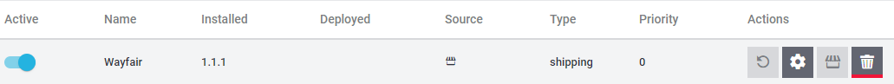

# Wayfair plugin: Updating

## Introduction
The Wayfair plugin may be updated at any time to ensure that it is providing the best possible experience for suppliers. **Plentymarkets does not automatically update the Wayfair plugin for users**, so suppliers must manually update when it is desired.

Prior to updating, review [the latest information on the Wayfair plugin's releases.](https://github.com/wayfair-contribs/plentymarkets-plugin/releases)

## Updating to the latest version of the Wayfair Plugin
1. From the main Plentymarkets page, go to `Plugins` >> `Plugin set overview`.
(**Do NOT select the deprecated, similarly named `Plugin overview` option, if it appears in the menu.**)

    

2. The screen will show a list of plugin sets, with a set of buttons for each one. Locate the Plugin Set where the Wayfair plugin is installed.

    * The list of plugins for the Plugin Set are hidden behind the `Edit plugin set` button.

        

3. Click on the Plugin Set.

4. Verify that a row exists on the page with the `Name` displayed as "Wayfair" and that the `Deployed` column is also populated, indicating that the plugin is in use:

    

5. Hover over the `Update` button  in the `Actions` column.

5. If the button is disabled, you already have the latest version of the Wayfair plugin. **Do not continue with this guide**:

    

6. Click the `Update` button . A page will be presented that has the Wayfair logo, information about the Wayfair plugin, and a new, different `Update` button at the top:

    

7. Review the information on the page.

9. In the `Select version` drop-down menu, choose [the newest plugin version](https://github.com/wayfair-contribs/plentymarkets-plugin/releases) if it is not already selected.

    

10. Click the `Update` button  at the top of the page. After a short pause, you will be redirected to the individual Plugin Set's details.

11. Verify that a row exists on the page with the `Name` displayed as "Wayfair" and the `Installed` version showing as the desired version.

12. In the `Active` column for the "Wayfair" row, activate the switch so that it is in the right-side, enabled position. **Failure to activate the Wayfair plugin will prevent its functionalities from being available**.

13. Verify that the Wayfair plugin's row looks like this:

    

14. Click the `Deploy plugin set` button (appears as a Save button):

    

15. A progress bar will appear while the plugin is installed.

16. Confirm that the `Deployed` column for the "Wayfair" row is now populated, and it reflects the value in the `Installed` column:

    

17. Log out of the Plentymarkets system, then log back in, to ensure that the changes are now in effect.
