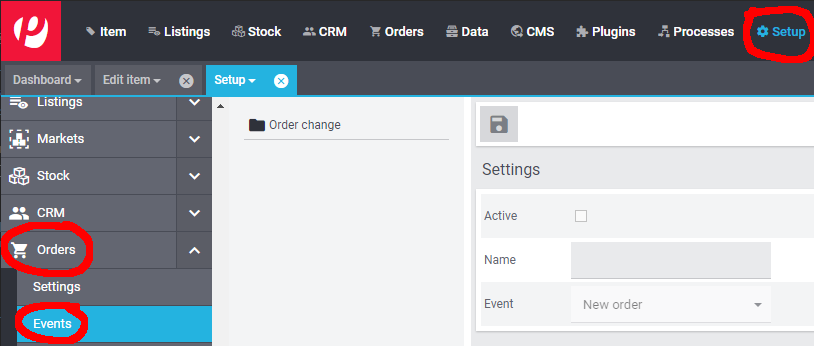

# Wayfair plugin: Using Wayfair's Shipping Account

## Introduction

### WayfairShipping Shipping Service Provider Type
The Wayfair plugin provides a type for Plentymarkets Shipping Service Provider Objects. The provider type does not have any configurable settings. Your Wayfair API credentials will be used to perform shipping-related operations.

### Shipping on Wayfair's Account
Wayfair's supplier partners may ship items using their preferred provider, but they also have the option of using Wayfair's shipment providers. This document covers the steps required for setting up Plentymarkets to use the "ship on Wayfair's account" option.

## 1. Creating the Shipping Service Provider
In order to create a Shipping Profile to be used for Orders, a Shipping Service Provider object must first be set up, which associates the Shipping Profile with a carrier. Follow these steps to create the Wayfair-specific Shipping Service Provider:

1. From the main Plentymarkets page, go to `Setup` >> `Orders` >> `Shipping` >> `Settings`:

    

2. Select the `Shipping service provider` tab:

    

3. Click the `New` button  to add a new row to the table.

4. In the new row that is created, populate the `Name` fields (we recommend **"WayfairShipping"** for all names, for simplicity's sake).

5. In the `Shipping service provider` field for the row, choose the `WayfairShipping` option - this reflects the type that is provided by the Wayfair plugin. **All other fields in the row may be left blank.**

6. Verify that the new row looks like this:

     

7. Click `Save` .

## 2. Creating the Shipping Profile
Each order has a Shipping Profile that is used for working with the shipping service provider to ship items from an order. Use these steps to set up the Wayfair-specific Shipping Profile.

1. From the main Plentymarkets page, go to `Setup` >> `Orders` >> `Shipping` >> `Settings`:

    

2. Select the `Shipping profiles` tab

    

3. If a Wayfair row already exists, click that row. Otherwise, click  the `New` button . The Shipping Profile's settings will appear.

4. Select your **Wayfair** `Shipping service provider` from the menu provided (it will likely be **"WayfairShipping"** if you have created [the suggested Shipping Service Provider](#1-creating-the-shipping-service-provider):

    

5. Populate the `Name` fields (we recommend **"WayfairShipping"** for all names, for simplicity's sake)

6. Set the language using the menu to the right of the `Name` field.

7. In the `Flag` field, choose the icon that will represent Wayfair orders (`6` and `126` are good options, as they reflect the Wayfair color scheme).

8. In the `Priority` field, optionally change the priority (we recommend leaving it as the default, "highest" priority).

9. In the `Clients (stores)` field, make sure to select all stores that may be set up for Wayfair.

10. In the `Order referrer` list, place a check mark next to any **"Wayfair"**-related entries.

    

11. Click on the `Save` button . at the top of the page. **You may need to scroll up in order to reveal the button.**

12. Observe that the new (or updated) Shipping Profile is listed:

    

## 3. Optionally selecting the Wayfair Shipping Profile automatically for Wayfair orders

1. From the main Plentymarkets page, go to  `Setup` >> `Orders` >> `Events`:
    

2.	Click on `Add event procedure` (the `+` button on the bottom left-hand side of the page):

    

3. Enter a `Name` such as **"Wayfair order Shipping Mapping"**.

4. Select the event `New order` from the dropdown menu:

    

5. Click the `Save` button  on the dialog. The new procedure will now be selected, with the `Settings` section in view.

6. In the `Settings` section of the event procedure, check the `Active` checkbox:
    

7. Click on `Add Filter`:

    

9.  Choose `Referrer` in the `Order` category:

    

10. Click the `Add` button .

11.	In the `Filter` section, a box should appear with a list of all available Order referrers. Place a checkmark next to all "Wayfair" order referrers:

    

12. Click on `Add procedure`:

    

12. Select `Order` >> `Change shipping profile`:

    

13. Click the `Add` button . to complete the dialog. A `Change shipping profile` Procedure will appear in the `Procedures` area.

12. Click on the left-most carat icon  on the left of the `Change shipping profile` Procedure's row **(this is NOT the large square button that also happens to have a carat icon on it)** to expand the Procedure's details:
    

13. In the drop-down menu on the Procedure, choose the [Shipping Profile created for WayfairShipping](#2-creating-the-shipping-profile):
    

14. Click the `Save` button  at the top of the page to complete the creation of the Event Procedure.
